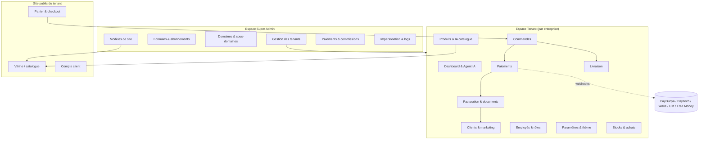
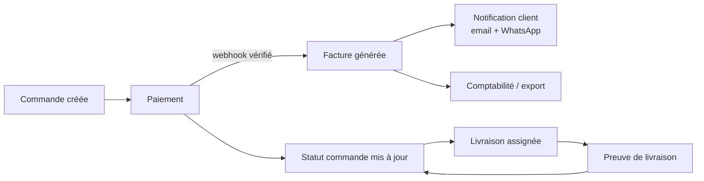

# 2. Architecture fonctionnelle

## 2.1 Vue d'ensemble des modules

## 2.2 Niveaux d'accès

| Niveau       | Portée                | Accès données                                                                                  |
| ------------ | --------------------- | ---------------------------------------------------------------------------------------------- |
| Super Admin  | Toute la plateforme   | Lecture/administration cross-tenant, jamais d'accès direct aux secrets de paiement des tenants |
| Propriétaire | Un tenant             | Accès complet à son tenant uniquement                                                          |
| Employé      | Un tenant, selon rôle | Accès limité par permissions (voir [05](05-roles-permissions.md))                              |

Le Super Admin agit **toujours** au travers d'un mécanisme d'impersonation journalisé (jamais de lecture silencieuse des données tenant) — voir [05](05-roles-permissions.md#impersonation).

## 2.3 Cycle de vie d'un tenant

1. Création par le Super Admin (ou auto-inscription + validation manuelle en V2) : nom, secteur d'activité, formule, sous-domaine proposé.
2. Attribution automatique d'un **modèle de site** correspondant au secteur (modifiable par le Super Admin).
3. Provisionnement : enregistrement du sous-domaine, création du schéma de données tenant (voir isolation en [03](03-architecture-technique.md)), période d'essai démarrée selon la formule.
4. Le propriétaire configure : identité visuelle, moyens de paiement activés, zones de livraison, employés.
5. Le tenant peut être suspendu (accès bloqué, données conservées) ou supprimé (soft delete + purge différée) par le Super Admin.
6. Le tenant peut demander un domaine personnalisé : vérification par enregistrement DNS TXT, puis émission automatique du certificat TLS.

## 2.4 Modèles de site par secteur

Chaque secteur active un **jeu de champs de catalogue** et un **jeu de blocs de page** au-dessus du même moteur commun (commandes, paiement, facture, client) :

| Secteur                | Entité catalogue spécifique     | Particularité de commande                                 |
| ---------------------- | ------------------------------- | --------------------------------------------------------- |
| E-commerce             | Produit + variantes             | Commande classique avec livraison                         |
| Restaurant / fast-food | Plat, menu, option              | Commande avec heure de retrait/livraison, table en option |
| Immobilier             | Bien (vente/location), visite   | Demande de visite plutôt que paiement immédiat            |
| Automobile             | Véhicule, fiche technique       | Demande de contact/essai, financement en option           |
| Salon / institut       | Prestation, durée               | Réservation de créneau (agenda)                           |
| Hôtel / location       | Chambre/logement, disponibilité | Réservation avec dates, calcul par nuitée                 |
| École / formation      | Cours, session                  | Inscription + paiement échelonné natif                    |
| Services               | Prestation                      | Devis puis facture d'acompte/finale                       |
| Livraison              | Course                          | Suivi temps réel, POD (preuve de livraison)               |
| Grossiste              | Produit + prix par palier       | Compte revendeur, prix de gros                            |

Le MVP livre le moteur commun + le template **e-commerce** uniquement (voir [09](09-plan-developpement.md)). Les autres secteurs réutilisent le même moteur de commande en configurant des champs différents — aucune réécriture du cœur n'est nécessaire.

## 2.5 Agent IA commerçant

Un service de question-réponse adossé aux données du tenant (lecture seule, jamais d'action destructrice sans confirmation explicite) :

- Traduit la question en requête agrégée sur les données du tenant (CA, produits, commandes, stock) — **jamais** un accès SQL libre généré par le LLM sur la base réelle : un jeu fixe de requêtes paramétrées est exposé au modèle (function calling), qui choisit la fonction et les paramètres.
- Répond en français avec chiffres réels en FCFA, jamais de valeur inventée.
- Exemples couverts nativement : produit le plus vendu, CA du mois, recommandations de réassort, commandes nécessitant une intervention (impayées, bloquées), risques de rupture de stock.

## 2.6 Assistant IA fiche produit

Pipeline : **Entrée** (photo(s) / texte / ligne Excel / page PDF / URL fournisseur) → **Extraction** (vision + OCR si besoin) → **Génération** (nom, catégorie, descriptions, mots-clés, prix suggéré, variantes, textes réseaux sociaux, traductions) → **Brouillon** (`AIGenerationJob`, statut `pending_review`) → **Validation humaine obligatoire** → **Publication**.

Aucun contenu généré par l'IA n'atteint le catalogue public sans un clic de validation du commerçant (ou d'un employé avec la permission `products.publish`).

## 2.7 Flux inter-modules clé

## 2.8 Gouvernance des formules d'abonnement

Chaque formule est une configuration de **limites** et de **fonctionnalités** appliquée en temps réel (middleware de vérification avant chaque action soumise à quota : ajout produit, ajout employé, génération IA, etc.). Le dépassement de quota bloque l'action avec un message explicite et une invitation à mettre à niveau — jamais un blocage silencieux.
