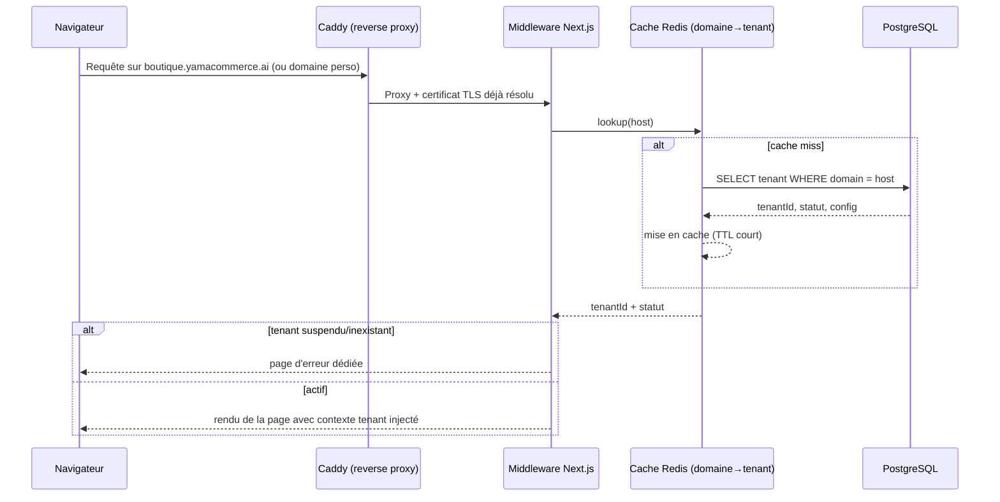
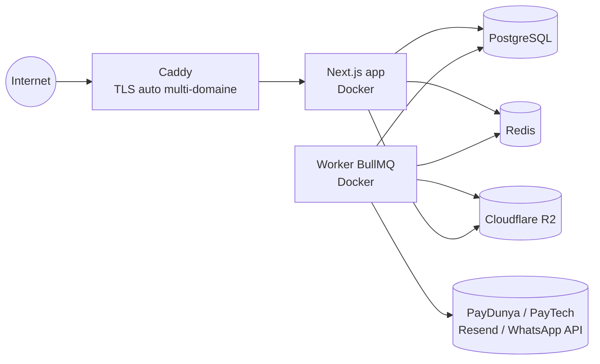

# 3. Architecture technique

## 3.1 Stack retenue et justifications

| Domaine                           | Choix                                                                                                                                 | Justification                                                                                                                                                                                                                                                        |
| --------------------------------- | ------------------------------------------------------------------------------------------------------------------------------------- | -------------------------------------------------------------------------------------------------------------------------------------------------------------------------------------------------------------------------------------------------------------------- |
| Framework web                     | **Next.js 14+ (App Router) / TypeScript**                                                                                             | Conforme à la demande ; SSR/ISR utile pour le SEO des vitrines publiques, API routes + server actions pour la logique métier                                                                                                                                         |
| UI                                | **Tailwind CSS + shadcn/ui**                                                                                                          | Conforme ; composants accessibles, thémables par tenant via variables CSS                                                                                                                                                                                            |
| Animations                        | **Framer Motion**, avec `prefers-reduced-motion` respecté et animations désactivées sur les listes longues (virtualisées)             | Conforme ; nécessite une discipline (pas d'animation sur les composants réutilisés en masse) pour ne pas casser les perfs mobiles                                                                                                                                    |
| Base de données                   | **PostgreSQL**                                                                                                                        | Conforme ; robustesse transactionnelle indispensable pour paiements/factures, support natif Row-Level Security                                                                                                                                                       |
| ORM                               | **Prisma**                                                                                                                            | Conforme ; migrations versionnées, typage bout en bout                                                                                                                                                                                                               |
| Auth                              | **Auth.js (NextAuth v5)** + couche custom OTP SMS                                                                                     | Conforme comme base ; ajout d'une vérification par code SMS/WhatsApp car l'email seul est peu fiable pour une partie des commerçants sénégalais                                                                                                                      |
| Monorepo                          | **pnpm workspaces + Turborepo** _(ajout)_                                                                                             | Nécessaire pour partager la logique (paiements, permissions, PDF, IA) entre l'app web et le worker de jobs sans dupliquer le code                                                                                                                                    |
| File d'attente                    | **Redis + BullMQ** _(ajout, requis par le cahier des charges)_                                                                        | Le CDC demande explicitement une file d'attente pour emails, factures et traitements IA ; BullMQ est le standard Node/TS le plus mature                                                                                                                              |
| Stockage fichiers                 | **Cloudflare R2 (compatible S3)** _(précision)_                                                                                       | Compatible S3 comme demandé ; sans frais de sortie, important pour un catalogue avec beaucoup d'images consultées depuis l'Afrique de l'Ouest via CDN                                                                                                                |
| Génération PDF                    | **@react-pdf/renderer** _(précision)_                                                                                                 | Documents structurés (factures, devis) : plus léger et plus fiable à grande échelle en file d'attente qu'un navigateur headless (Puppeteer)                                                                                                                          |
| Email transactionnel              | **Resend + react-email** _(précision)_                                                                                                | Bonne délivrabilité, templates en JSX cohérents avec le reste de la stack                                                                                                                                                                                            |
| SMS / OTP                         | **Twilio** (ou passerelle locale équivalente, interface interchangeable)                                                              | API officielle, nécessaire pour la double authentification et les notifications SMS                                                                                                                                                                                  |
| WhatsApp                          | **WhatsApp Business Cloud API (Meta, officielle)**                                                                                    | Explicitement requis (envoi de factures, notifications) ; seule API officielle disponible                                                                                                                                                                            |
| Paiements Sénégal                 | **PayDunya** et **PayTech** comme agrégateurs principaux (Wave, Orange Money, Free Money, cartes) + **paiement à la livraison** natif | Ce sont les intégrations _officiellement disponibles_ côté marchand pour couvrir Wave/OM/Free Money/carte sans accord bilatéral direct avec chaque opérateur ; architecture en adaptateurs pour brancher une API directe (ex. Wave Business) dès qu'un accord existe |
| Reverse proxy / TLS multi-domaine | **Caddy** _(ajout)_                                                                                                                   | Émission automatique de certificats TLS à la demande (« on-demand TLS ») indispensable pour supporter un domaine personnalisé par tenant sans intervention manuelle                                                                                                  |
| IA                                | Couche d'abstraction `packages/ai` au-dessus d'un modèle multimodal (vision + texte)                                                  | Le fournisseur concret est interchangeable par configuration ; aucun couplage fort du code métier à un SDK IA particulier                                                                                                                                            |
| Tests                             | **Vitest** (unitaire/intégration) + **Playwright** (e2e)                                                                              | Conforme ; rapide en CI                                                                                                                                                                                                                                              |
| Conteneurisation                  | **Docker** + docker-compose (dev)                                                                                                     | Conforme                                                                                                                                                                                                                                                             |
| Erreurs / observabilité           | **Sentry** (erreurs) + journal d'audit applicatif en base                                                                             | Nécessaire pour la page « erreurs et activités importantes » du Super Admin                                                                                                                                                                                          |

## 3.2 Stratégie multi-tenant

**Choix : base de données unique partagée, discriminant `tenantId` sur chaque table métier, avec Row-Level Security PostgreSQL en défense en profondeur.**

Alternatives écartées :

- _Schéma par tenant_ : isolation plus forte mais migrations et opérations (des centaines de schémas) beaucoup plus lourdes pour un volume de PME ; retenu comme option de bascule pour un futur palier « Entreprise » à très fort volume si nécessaire.
- _Base par tenant_ : trop coûteux opérationnellement à l'échelle visée (centaines de tenants).

Mise en œuvre :

1. Toute table métier porte une colonne `tenantId` (sauf tables globales : `User`, `Plan`, `SiteTemplate`, logs plateforme).
2. Une politique **RLS** par table (`USING (tenant_id = current_setting('app.current_tenant_id')::uuid)`) est activée en base — même si une requête applicative oublie le filtre, Postgres bloque l'accès croisé.
3. Le middleware Prisma (`packages/database`) injecte automatiquement `tenantId` sur chaque `where`/`create`, et positionne `app.current_tenant_id` en début de transaction à partir de la session authentifiée.
4. Contraintes d'unicité toujours composées avec `tenantId` (ex. `@@unique([tenantId, slug])`), jamais globales, pour éviter qu'un tenant bloque un identifiant pour un autre.
5. Aucune route API ne doit accepter un `tenantId` fourni par le client sans le confronter à la session — le tenant courant est toujours dérivé du domaine/sous-domaine + de la session, jamais d'un paramètre de requête libre.

## 3.3 Résolution du tenant par domaine

Caddy gère le TLS automatique par domaine (« on-demand TLS » avec une liste blanche de domaines vérifiés en base, pour éviter tout abus de certificats).

## 3.4 Architecture des paiements

- **Pattern adaptateur** : une interface commune `PaymentProviderAdapter` (`createPayment`, `verifyWebhook`, `getStatus`, `refund`) implémentée par `PayDunyaAdapter`, `PayTechAdapter`, `CashOnDeliveryAdapter` (et futurs `WaveDirectAdapter`, `OrangeMoneyDirectAdapter`).
- **Aucune confirmation de paiement côté client n'est jamais fiable** : le statut `succeeded` n'est écrit qu'après réception et vérification cryptographique d'un webhook (signature/clé partagée fournie par PayDunya/PayTech), traité par un worker dédié.
- **Idempotence** : chaque webhook porte un identifiant d'événement stocké de façon unique (`PaymentWebhookEvent.eventId`) ; un rejeu est détecté et ignoré. Chaque tentative de paiement porte une `idempotencyKey` générée côté serveur avant redirection vers le prestataire, empêchant la création de deux paiements pour une même intention.
- **Secrets** : clés API des prestataires stockées en variables d'environnement (dev) / gestionnaire de secrets (prod, ex. Doppler ou AWS Secrets Manager) — jamais en base ni dans le code. Le tenant choisit dans son dashboard quels moyens sont actifs ; les identifiants d'API restent gérés par la plateforme (mode agrégateur) sauf formule « Entreprise » où le tenant peut fournir ses propres identifiants marchands, chiffrés au repos (AES-256) avant stockage.
- **Aucune donnée bancaire** (numéro de carte, etc.) ne transite ni n'est stockée par YamaCommerce AI : la saisie a lieu exclusivement sur la page hébergée du prestataire (PayDunya/PayTech).

## 3.5 Files d'attente et traitements asynchrones

Worker Node séparé (`apps/worker`) consommant des files Redis/BullMQ dédiées :

| File                | Producteur                                                         | Traitement                                                                     |
| ------------------- | ------------------------------------------------------------------ | ------------------------------------------------------------------------------ |
| `emails`            | API, événements commande/paiement                                  | Rendu template + envoi Resend                                                  |
| `invoices`          | Confirmation paiement / validation COD                             | Génération PDF, numérotation séquentielle, QR code, envoi                      |
| `ai-jobs`           | Assistant produit, agent IA                                        | Appel modèle, parsing, écriture en `AIGenerationJob` (statut `pending_review`) |
| `imports`           | Import Excel/CSV/PDF/URL                                           | Parsing par lot, création de brouillons produits                               |
| `webhooks-payments` | Endpoint webhook (mise en file immédiate, réponse HTTP 200 rapide) | Vérification signature, mise à jour paiement, déclenchement facture            |
| `notifications`     | Tous modules                                                       | Envoi SMS/WhatsApp selon canaux activés par tenant                             |

Chaque job est journalisé avec statut et erreurs (retry avec backoff exponentiel, dead-letter queue après N échecs, visible au Super Admin dans la page « erreurs »).

## 3.6 Sécurité

- **Auth** : mots de passe hachés (Argon2id), sessions JWT courtes + refresh, 2FA TOTP obligatoire pour Super Admin et recommandé pour les propriétaires.
- **RBAC** : vérification des permissions côté serveur sur chaque action (jamais seulement côté UI) — voir [05](05-roles-permissions.md).
- **Rate limiting** : par IP et par compte sur les endpoints sensibles (login, OTP, webhooks) via Redis (algorithme sliding window).
- **Validation** : schémas Zod partagés entre client et serveur, toute entrée revalidée côté serveur même si déjà validée côté client.
- **Audit log** : table append-only, jamais modifiable depuis l'application, incluant les actions Super Admin (impersonation, suspension, changement de formule).
- **Sauvegardes** : dump PostgreSQL quotidien chiffré, rétention 30 jours, restauration testée périodiquement.
- **Protection attaques courantes** : en-têtes de sécurité (CSP, HSTS), protection CSRF sur les mutations, échappement systématique (XSS), requêtes paramétrées uniquement (injection SQL) via Prisma.

## 3.7 Déploiement

Déploiement conteneurisé (Docker Compose pour le développement ; images identiques poussées vers un orchestrateur simple — ex. un VPS avec Docker Compose ou Coolify — pour la V1, migration vers Kubernetes envisageable seulement si le volume de tenants le justifie).

## 3.8 Préparation à l'application mobile

L'API métier est exposée en interne via des **server actions / route handlers REST-JSON stables** (pas uniquement des server actions couplées au rendu), versionnée (`/api/v1/...`), avec authentification par token porteur — réutilisable telle quelle par une future app mobile (React Native) sans réécriture du backend.
