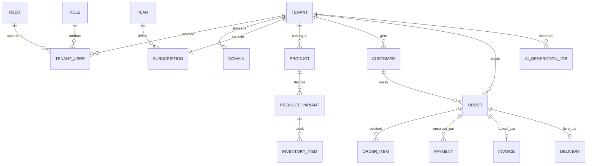

# 4. Schéma de base de données

## 4.1 Vue d'ensemble (ERD simplifié)



## 4.2 Principes structurants

1. **Isolation** : toute table métier possède `tenantId`. Les contraintes d'unicité sont composées `[tenantId, champ]`.
2. **Numérotation séquentielle sans collision** : une table `Counter` (`tenantId`, `scope` ex. `invoice-2026`, `value`) est incrémentée en transaction (`SELECT ... FOR UPDATE`) pour générer les numéros de facture/commande/devis — jamais un simple `COUNT(*)` (source de doublons en concurrence).
3. **Traçabilité** : les tables sensibles (`Order`, `Payment`, `Invoice`) ne sont jamais mises à jour « en silence » sur les champs critiques — un historique dédié (`OrderStatusHistory`) ou l'immutabilité (`Invoice.finalizedAt`) l'empêche.
4. **Montants** : type `Int` en FCFA (unité entière, pas de sous-unité), jamais `Float`.
5. **Suppressions** : soft delete (`deletedAt`) sur les entités qui doivent rester consultables dans l'historique (Tenant, Product, Customer) ; suppression dure uniquement sur les brouillons.

## 4.3 Schéma Prisma (draft — deviendra `packages/database/schema.prisma` en Phase 0)

```prisma
// ================== PLATEFORME ==================

enum BusinessType {
  ECOMMERCE
  RESTAURANT
  REAL_ESTATE
  AUTOMOBILE
  SALON
  HOTEL
  SCHOOL
  SERVICES
  DELIVERY
  WHOLESALE
}

enum TenantStatus {
  PENDING
  ACTIVE
  SUSPENDED
  DELETED
}

model Tenant {
  id            String       @id @default(uuid())
  name          String
  slug          String       @unique
  businessType  BusinessType
  status        TenantStatus @default(PENDING)
  themeId       String?
  branding      Json         // { logoUrl, primaryColor, secondaryColor, defaultMode }
  currency      String       @default("XOF")
  locale        String       @default("fr")
  timezone      String       @default("Africa/Dakar")
  trialEndsAt   DateTime?
  createdAt     DateTime     @default(now())
  updatedAt     DateTime     @updatedAt
  deletedAt     DateTime?

  domains       Domain[]
  users         TenantUser[]
  shops         Shop[]
  products      Product[]
  categories    Category[]
  customers     Customer[]
  orders        Order[]
  invoices      Invoice[]
  quotes        Quote[]
  subscription  Subscription?
  auditLogs     AuditLog[]
  paymentConfigs PaymentProviderConfig[]
  deliveryZones DeliveryZone[]
  counters      Counter[]
  aiJobs        AIGenerationJob[]
  expenses      Expense[]
  suppliers     Supplier[]
  promoCodes    PromoCode[]
  giftCards     GiftCard[]
  site          TenantSite?
}

model Domain {
  id             String   @id @default(uuid())
  tenantId       String
  tenant         Tenant   @relation(fields: [tenantId], references: [id])
  domain         String   @unique
  type           String   // "subdomain" | "custom"
  isPrimary      Boolean  @default(false)
  verified       Boolean  @default(false)
  verificationToken String?
  sslStatus      String   @default("pending") // pending|issued|failed
  createdAt      DateTime @default(now())

  @@index([tenantId])
}

model Plan {
  id                    String   @id @default(uuid())
  name                  String   @unique // Essentiel, Business, Premium, Entreprise
  priceMonthly          Int
  priceYearly           Int
  trialDays             Int      @default(14)
  maxProducts           Int
  maxEmployees          Int
  maxShops              Int
  storageMB             Int
  aiGenerationsPerMonth Int
  customDomainAllowed   Boolean  @default(false)
  advancedReports       Boolean  @default(false)
  whatsappAutomation    Boolean  @default(false)
  commissionRate        Decimal  @default(0) // % prélevé sur les ventes
  features             Json     // liste extensible de clés de fonctionnalités
  isActive              Boolean  @default(true)
  subscriptions         Subscription[]
}

enum SubscriptionStatus {
  TRIALING
  ACTIVE
  PAST_DUE
  CANCELED
}

model Subscription {
  id                 String             @id @default(uuid())
  tenantId           String             @unique
  tenant             Tenant             @relation(fields: [tenantId], references: [id])
  planId             String
  plan               Plan               @relation(fields: [planId], references: [id])
  status             SubscriptionStatus @default(TRIALING)
  billingCycle       String             // monthly|yearly
  currentPeriodStart DateTime
  currentPeriodEnd   DateTime
  cancelAtPeriodEnd  Boolean            @default(false)
  createdAt          DateTime           @default(now())
}

// ================== IDENTITÉ & ACCÈS ==================

model User {
  id                 String   @id @default(uuid())
  email              String?  @unique
  phone              String?  @unique
  passwordHash       String
  fullName           String
  isSuperAdmin       Boolean  @default(false)
  twoFactorEnabled   Boolean  @default(false)
  twoFactorSecret    String?
  lastLoginAt        DateTime?
  createdAt          DateTime @default(now())

  memberships        TenantUser[]
  impersonations     ImpersonationSession[] @relation("SuperAdminActor")
}

model Role {
  id          String   @id @default(uuid())
  tenantId    String?  // null = rôle système global (ex. gabarit "Gérant")
  name        String
  isSystem    Boolean  @default(false)
  permissions String[] // clés de permission, ex. "orders.update_status"
  createdAt   DateTime @default(now())

  memberships TenantUser[]

  @@unique([tenantId, name])
}

enum TenantUserStatus {
  INVITED
  ACTIVE
  SUSPENDED
}

model TenantUser {
  id         String           @id @default(uuid())
  tenantId   String
  tenant     Tenant           @relation(fields: [tenantId], references: [id])
  userId     String
  user       User             @relation(fields: [userId], references: [id])
  roleId     String
  role       Role             @relation(fields: [roleId], references: [id])
  status     TenantUserStatus @default(INVITED)
  invitedBy  String?
  joinedAt   DateTime?
  createdAt  DateTime         @default(now())

  @@unique([tenantId, userId])
  @@index([tenantId])
}

model ImpersonationSession {
  id              String    @id @default(uuid())
  superAdminId    String
  superAdmin      User      @relation("SuperAdminActor", fields: [superAdminId], references: [id])
  tenantId        String
  targetUserId    String?
  reason          String
  startedAt       DateTime  @default(now())
  endedAt         DateTime?

  @@index([tenantId])
}

model AuditLog {
  id          String   @id @default(uuid())
  tenantId    String?  // null pour une action strictement plateforme
  tenant      Tenant?  @relation(fields: [tenantId], references: [id])
  actorUserId String?
  actorType   String   // super_admin | owner | employee | system
  action      String   // ex. "order.status_changed"
  entityType  String
  entityId    String
  metadata    Json?
  ipAddress   String?
  createdAt   DateTime @default(now())

  @@index([tenantId, createdAt])
}

// ================== CATALOGUE ==================

model Shop {
  id        String   @id @default(uuid())
  tenantId  String
  tenant    Tenant   @relation(fields: [tenantId], references: [id])
  name      String
  region    String?
  department String?
  commune   String?
  isMain    Boolean  @default(true)
  isWarehouse Boolean @default(false)

  @@index([tenantId])
}

model Category {
  id       String     @id @default(uuid())
  tenantId String
  tenant   Tenant     @relation(fields: [tenantId], references: [id])
  name     String
  slug     String
  parentId String?
  parent   Category?  @relation("CategoryTree", fields: [parentId], references: [id])
  children Category[] @relation("CategoryTree")
  imageUrl String?

  products Product[]

  @@unique([tenantId, slug])
}

enum ProductStatus {
  DRAFT
  PUBLISHED
  ARCHIVED
}

model Product {
  id               String        @id @default(uuid())
  tenantId         String
  tenant           Tenant        @relation(fields: [tenantId], references: [id])
  categoryId       String?
  category         Category?     @relation(fields: [categoryId], references: [id])
  name             String
  slug             String
  description      String?
  shortDescription String?
  sku              String?
  brand            String?
  status           ProductStatus @default(DRAFT)
  basePrice        Int
  compareAtPrice   Int?
  costPrice        Int?
  taxRate          Decimal       @default(0)
  seoKeywords      String[]
  tags             String[]
  aiGenerated      Boolean       @default(false)
  aiGenerationJobId String?
  createdBy        String?
  createdAt        DateTime      @default(now())
  updatedAt        DateTime      @updatedAt
  deletedAt        DateTime?

  images   ProductImage[]
  variants ProductVariant[]
  reviews  Review[]
  wishlists Wishlist[]

  @@unique([tenantId, slug])
  @@index([tenantId, status])
}

model ProductImage {
  id        String   @id @default(uuid())
  productId String
  product   Product  @relation(fields: [productId], references: [id])
  variantId String?
  url       String
  altText   String?
  position  Int      @default(0)
}

model ProductVariant {
  id         String   @id @default(uuid())
  productId  String
  product    Product  @relation(fields: [productId], references: [id])
  name       String   // ex. "Rouge / M"
  sku        String?
  price      Int
  costPrice  Int?
  barcode    String?
  weightGrams Int?
  volumeCm3  Int?
  attributes Json     // { color, size, ... }

  inventoryItems InventoryItem[]
  orderItems     OrderItem[]

  @@index([productId])
}

model InventoryItem {
  id               String         @id @default(uuid())
  productVariantId String
  variant          ProductVariant @relation(fields: [productVariantId], references: [id])
  shopId           String
  shop             Shop           @relation(fields: [shopId], references: [id])
  quantity         Int            @default(0)
  reservedQuantity Int            @default(0)
  lowStockThreshold Int           @default(5)

  movements StockMovement[]

  @@unique([productVariantId, shopId])
}

model StockMovement {
  id              String        @id @default(uuid())
  inventoryItemId String
  inventoryItem   InventoryItem @relation(fields: [inventoryItemId], references: [id])
  type            String        // in|out|adjustment|transfer|return
  quantity        Int
  reason          String?
  referenceType   String?       // order|purchase|manual
  referenceId     String?
  performedBy     String?
  createdAt       DateTime      @default(now())
}

model Supplier {
  id       String @id @default(uuid())
  tenantId String
  tenant   Tenant @relation(fields: [tenantId], references: [id])
  name     String
  phone    String?
  address  String?
}

model Expense {
  id          String   @id @default(uuid())
  tenantId    String
  tenant      Tenant   @relation(fields: [tenantId], references: [id])
  category    String
  amount      Int
  description String?
  date        DateTime
  attachmentUrl String?
  createdBy   String?
}

// ================== CLIENTS ==================

model Customer {
  id            String   @id @default(uuid())
  tenantId      String
  tenant        Tenant   @relation(fields: [tenantId], references: [id])
  userId        String?
  firstName     String
  lastName      String?
  email         String?
  phone         String?
  customerGroup String   @default("retail") // retail|wholesale|reseller
  loyaltyPoints Int      @default(0)
  referralCode  String?  @unique
  referredById  String?
  totalSpent    Int      @default(0)
  ordersCount   Int      @default(0)
  createdAt     DateTime @default(now())

  addresses CustomerAddress[]
  orders    Order[]
  wishlists Wishlist[]
  reviews   Review[]

  @@unique([tenantId, phone])
  @@index([tenantId])
}

model CustomerAddress {
  id          String   @id @default(uuid())
  customerId  String
  customer    Customer @relation(fields: [customerId], references: [id])
  label       String?
  region      String
  department  String?
  commune     String?
  neighborhood String? // quartier
  street      String?
  geoLat      Float?
  geoLng      Float?
  isDefault   Boolean  @default(false)
}

model Wishlist {
  id         String   @id @default(uuid())
  customerId String
  customer   Customer @relation(fields: [customerId], references: [id])
  productId  String
  product    Product  @relation(fields: [productId], references: [id])

  @@unique([customerId, productId])
}

model Review {
  id         String   @id @default(uuid())
  productId  String
  product    Product  @relation(fields: [productId], references: [id])
  customerId String
  customer   Customer @relation(fields: [customerId], references: [id])
  rating     Int
  comment    String?
  status     String   @default("pending") // pending|approved|rejected
  response   String?
  createdAt  DateTime @default(now())
}

model PromoCode {
  id            String   @id @default(uuid())
  tenantId      String
  tenant        Tenant   @relation(fields: [tenantId], references: [id])
  code          String
  type          String   // percentage|fixed|free_shipping
  value         Int
  minOrderAmount Int?
  usageLimit    Int?
  usageCount    Int      @default(0)
  startsAt      DateTime?
  endsAt        DateTime?

  @@unique([tenantId, code])
}

model GiftCard {
  id           String    @id @default(uuid())
  tenantId     String
  tenant       Tenant    @relation(fields: [tenantId], references: [id])
  code         String    @unique
  initialValue Int
  balance      Int
  expiresAt    DateTime?
}

// ================== COMMANDES ==================

enum OrderStatus {
  NEW
  AWAITING_PAYMENT
  PAID
  CONFIRMED
  PREPARING
  READY
  SHIPPED
  OUT_FOR_DELIVERY
  DELIVERED
  CANCELED
  REFUNDED
}

enum PaymentStatus {
  UNPAID
  PARTIAL
  PAID
  REFUNDED
  FAILED
}

model Order {
  id             String        @id @default(uuid())
  tenantId       String
  tenant         Tenant        @relation(fields: [tenantId], references: [id])
  shopId         String?
  customerId     String
  customer       Customer      @relation(fields: [customerId], references: [id])
  orderNumber    String        // séquentiel par tenant, ex. CMD-2026-000123
  status         OrderStatus   @default(NEW)
  channel        String        @default("web") // web|whatsapp|instore|phone
  paymentStatus  PaymentStatus @default(UNPAID)
  subtotal       Int
  discountTotal  Int           @default(0)
  shippingTotal  Int           @default(0)
  taxTotal       Int           @default(0)
  total          Int
  currency       String        @default("XOF")
  deliveryZoneId String?
  deliveryAddressId String?
  notes          String?
  createdAt      DateTime      @default(now())
  updatedAt      DateTime      @updatedAt

  items          OrderItem[]
  statusHistory  OrderStatusHistory[]
  payments       Payment[]
  invoice        Invoice?
  delivery       Delivery?

  @@unique([tenantId, orderNumber])
  @@index([tenantId, status])
  @@index([tenantId, createdAt])
}

model OrderItem {
  id               String  @id @default(uuid())
  orderId          String
  order            Order   @relation(fields: [orderId], references: [id])
  productVariantId String
  variant          ProductVariant @relation(fields: [productVariantId], references: [id])
  productNameSnapshot String
  unitPrice        Int
  quantity         Int
  discount         Int     @default(0)
  taxRate          Decimal @default(0)
  total            Int
}

model OrderStatusHistory {
  id            String      @id @default(uuid())
  orderId       String
  order         Order       @relation(fields: [orderId], references: [id])
  fromStatus    OrderStatus?
  toStatus      OrderStatus
  changedBy     String?
  changedByType String      // owner|employee|system|customer
  note          String?
  createdAt     DateTime    @default(now())
}

// ================== PAIEMENTS ==================

model PaymentProviderConfig {
  id          String   @id @default(uuid())
  tenantId    String
  tenant      Tenant   @relation(fields: [tenantId], references: [id])
  provider    String   // wave|orange_money|free_money|card|paydunya|paytech|cod
  isEnabled   Boolean  @default(false)
  mode        String   @default("live") // live|test
  credentialsRef String? // pointeur vers le secret chiffré, jamais la clé en clair

  @@unique([tenantId, provider])
}

enum PaymentTxStatus {
  PENDING
  SUCCEEDED
  FAILED
  REFUNDED
}

model Payment {
  id                    String          @id @default(uuid())
  tenantId              String
  orderId               String
  order                 Order           @relation(fields: [orderId], references: [id])
  provider              String
  providerTransactionId String?         @unique
  idempotencyKey        String          @unique
  amount                Int
  currency              String          @default("XOF")
  status                PaymentTxStatus @default(PENDING)
  type                  String          @default("full") // full|partial|installment
  rawPayload            Json?
  verifiedAt            DateTime?
  createdAt             DateTime        @default(now())

  @@index([tenantId, status])
}

model PaymentWebhookEvent {
  id          String   @id @default(uuid())
  provider    String
  eventId     String   // identifiant fourni par le prestataire
  payload     Json
  status      String   @default("received") // received|processed|ignored|error
  receivedAt  DateTime @default(now())
  processedAt DateTime?

  @@unique([provider, eventId]) // clé d'idempotence webhook
}

model InstallmentPlan {
  id            String        @id @default(uuid())
  orderId       String        @unique
  totalAmount   Int
  installments  Installment[]
}

model Installment {
  id                String          @id @default(uuid())
  installmentPlanId String
  plan              InstallmentPlan @relation(fields: [installmentPlanId], references: [id])
  dueDate           DateTime
  amount            Int
  status            String          @default("pending") // pending|paid|overdue
  paidPaymentId     String?
}

// ================== DOCUMENTS ==================

model Counter {
  id       String @id @default(uuid())
  tenantId String
  tenant   Tenant @relation(fields: [tenantId], references: [id])
  scope    String // ex. "invoice-2026", "order-2026"
  value    Int    @default(0)

  @@unique([tenantId, scope])
}

model Invoice {
  id             String    @id @default(uuid())
  tenantId       String
  tenant         Tenant    @relation(fields: [tenantId], references: [id])
  orderId        String?   @unique
  order          Order?    @relation(fields: [orderId], references: [id])
  number         String    // séquentiel, ex. FAC-2026-000045
  type           String    @default("invoice") // invoice|deposit_invoice|final_invoice
  status         String    @default("draft") // draft|finalized|canceled
  issueDate      DateTime  @default(now())
  dueDate        DateTime?
  customerSnapshot Json
  itemsSnapshot  Json
  subtotal       Int
  discountTotal  Int       @default(0)
  taxTotal       Int
  total          Int
  paymentStatus  PaymentStatus @default(UNPAID)
  qrCodeToken    String    @unique
  pdfUrl         String?
  finalizedAt    DateTime?
  integrityHash  String?   // empreinte du contenu au moment de la finalisation

  creditNotes CreditNote[]

  @@unique([tenantId, number])
}

model CreditNote {
  id        String   @id @default(uuid())
  invoiceId String
  invoice   Invoice  @relation(fields: [invoiceId], references: [id])
  number    String
  reason    String
  amount    Int
  pdfUrl    String?
  createdAt DateTime @default(now())
}

model Quote {
  id          String   @id @default(uuid())
  tenantId    String
  tenant      Tenant   @relation(fields: [tenantId], references: [id])
  customerId  String
  number      String
  status      String   @default("draft") // draft|sent|accepted|rejected|expired
  itemsSnapshot Json
  total       Int
  validUntil  DateTime?
  pdfUrl      String?

  @@unique([tenantId, number])
}

model DeliveryNote {
  id           String   @id @default(uuid())
  orderId      String   @unique
  number       String
  pdfUrl       String?
  signedBy     String?
  signatureUrl String?
  deliveredAt  DateTime?
}

model Refund {
  id        String   @id @default(uuid())
  tenantId  String
  orderId   String
  paymentId String
  amount    Int
  reason    String?
  status    String   @default("pending")
  processedBy String?
  createdAt DateTime @default(now())
}

// ================== LIVRAISON ==================

model DeliveryZone {
  id             String  @id @default(uuid())
  tenantId       String
  tenant         Tenant  @relation(fields: [tenantId], references: [id])
  region         String
  department     String?
  commune        String?
  neighborhood   String?
  fee            Int
  freeThreshold  Int?
  estimatedDays  Int?
}

model Deliverer {
  id        String   @id @default(uuid())
  tenantId  String
  userId    String?
  phone     String
  vehicleType String?
  isActive  Boolean  @default(true)

  deliveries Delivery[]
}

model Delivery {
  id                String    @id @default(uuid())
  orderId           String    @unique
  order             Order     @relation(fields: [orderId], references: [id])
  delivererId       String?
  deliverer         Deliverer? @relation(fields: [delivererId], references: [id])
  status            String    @default("assigned") // assigned|picked_up|in_transit|delivered|failed
  proofType         String?   // photo|signature|code
  proofUrl          String?
  codAmountCollected Int?
  codRemittedAt     DateTime?
  createdAt         DateTime  @default(now())
}

model DelivererRemittance {
  id          String   @id @default(uuid())
  delivererId String
  amount      Int
  remittedAt  DateTime @default(now())
  confirmedBy String?
}

// ================== IA ==================

model AIGenerationJob {
  id             String   @id @default(uuid())
  tenantId       String
  tenant         Tenant   @relation(fields: [tenantId], references: [id])
  type           String   // product_from_photo|product_from_text|bulk_import|translation|marketing_copy|chat_query
  status         String   @default("pending") // pending|processing|completed|failed
  inputPayload   Json
  outputPayload  Json?
  model          String?
  createdBy      String?
  createdAt      DateTime @default(now())
  reviewedAt     DateTime?
  reviewedBy     String?
  approved       Boolean  @default(false)
}

model ImportJob {
  id            String   @id @default(uuid())
  tenantId      String
  sourceType    String   // csv|excel|pdf|url|photos
  fileUrl       String?
  status        String   @default("pending")
  totalRows     Int?
  processedRows Int      @default(0)
  errorLog      Json?
  createdBy     String?
  createdAt     DateTime @default(now())
}

// ================== SITE & THÈME ==================

model SiteTemplate {
  id              String       @id @default(uuid())
  name            String
  businessType    BusinessType
  previewImageUrl String?
  componentsConfig Json
  isActive        Boolean      @default(true)
}

model TenantSite {
  id          String   @id @default(uuid())
  tenantId    String   @unique
  tenant      Tenant   @relation(fields: [tenantId], references: [id])
  templateId  String
  themeConfig Json     // { colors, fonts, defaultMode: "light"|"dark" }
  seoConfig   Json?
  published   Boolean  @default(false)
  publishedAt DateTime?

  pages Page[]
}

model Page {
  id           String     @id @default(uuid())
  tenantSiteId String
  tenantSite   TenantSite @relation(fields: [tenantSiteId], references: [id])
  slug         String
  title        String
  blocks       Json       // structure du page builder
  isHome       Boolean    @default(false)

  @@unique([tenantSiteId, slug])
}

// ================== NOTIFICATIONS ==================

model NotificationTemplate {
  id          String   @id @default(uuid())
  tenantId    String?  // null = modèle par défaut plateforme
  type        String   // order_confirmed|payment_failed|...
  channel     String   // email|sms|whatsapp|internal
  subject     String?
  bodyTemplate String
  isCustomized Boolean @default(false)

  @@unique([tenantId, type, channel])
}

// ================== PLATEFORME / FACTURATION INTERNE ==================

model Commission {
  id        String   @id @default(uuid())
  tenantId  String
  orderId   String
  rate      Decimal
  amount    Int
  invoicedToTenant Boolean @default(false)
  createdAt DateTime @default(now())
}

model ErrorLog {
  id        String   @id @default(uuid())
  tenantId  String?
  level     String   // info|warning|error|critical
  message   String
  stack     String?
  context   Json?
  createdAt DateTime @default(now())

  @@index([level, createdAt])
}
```

## 4.4 Notes d'implémentation

- **Row-Level Security** : pour chaque table portant `tenantId`, une migration SQL brute (hors Prisma, exécutée après `prisma migrate`) active :
  ```sql
  ALTER TABLE "Order" ENABLE ROW LEVEL SECURITY;
  CREATE POLICY tenant_isolation ON "Order"
    USING (tenant_id = current_setting('app.current_tenant_id', true)::uuid);
  ```
- **Génération de numéro séquentiel** (extrait du service `packages/database/counters.ts`, illustratif — code complet en Phase 1) :
  ```ts
  await prisma.$transaction(async (tx) => {
    const counter = await tx.counter.upsert({
      where: { tenantId_scope: { tenantId, scope: `invoice-${year}` } },
      create: { tenantId, scope: `invoice-${year}`, value: 1 },
      update: { value: { increment: 1 } },
    });
    return `FAC-${year}-${String(counter.value).padStart(6, "0")}`;
  });
  ```
- **Index de performance** ajoutés dès la migration initiale sur toutes les paires `(tenantId, champ de filtre fréquent)` : `Order(tenantId, status)`, `Order(tenantId, createdAt)`, `Product(tenantId, status)`.
- Les tables `Role`, `Plan`, `SiteTemplate`, `NotificationTemplate` (variante globale) sont les seules à autoriser `tenantId` nul, pour les gabarits fournis par la plateforme.

## 4.5 Extension multi-secteurs (planifiée — pas encore migrée)

> Modèles supplémentaires requis par l'architecture multi-business (voir [11](11-secteurs-et-modules.md) et [12](12-systeme-templates-et-direction-artistique.md)). Ils viendront s'ajouter au schéma existant dans une migration dédiée, une fois les secteurs/templates/directions artistiques validés — **aucune migration n'est encore générée pour cette section**.

### 4.5.1 Registre secteurs / modules

```prisma
model Sector {
  id                     String   @id @default(uuid())
  key                    String   @unique // ecommerce | fashion | restaurant | real_estate | custom | ...
  name                   String
  iconKey                String?
  vocabulary             Json     @default("{}") // { "catalog": "Biens", "item": "Bien", ... } — libellés d'interface
  description            String?
  defaultModuleKeys      String[]
  optionalModuleKeys     String[] @default([])
  compatibleTemplateTags String[] @default([]) // filtre les SiteTemplate proposés à ce secteur
  proposedPageManifest   Json     @default("[]") // types de page du §12.6 à activer par défaut
  customFieldSchema      Json?    // JSON Schema validant les attributs variables des Listing de ce secteur
  isSystem               Boolean  @default(true) // false = créé par un Super Admin via formulaire (§11.7.2)
  isActive               Boolean  @default(true)
  createdBy              String?
}

model Module {
  id          String   @id @default(uuid())
  key         String   @unique // ex. "listings", "leases", "appointments"
  name        String
  category    String   // "core" | "sector"
  sectorKeys  String[] // secteurs auxquels ce module sectoriel s'applique ([] si core)
  description String?
}

model TenantModule {
  id         String   @id @default(uuid())
  tenantId   String
  tenant     Tenant   @relation(fields: [tenantId], references: [id])
  moduleKey  String
  isEnabled  Boolean  @default(true)
  source     String   // "sector_default" | "manual" | "plan_included"
  config     Json?    // paramétrage propre au module pour ce tenant
  enabledAt  DateTime @default(now())

  @@unique([tenantId, moduleKey])
}
```

`Plan` gagne un champ `includedModuleKeys String[]` (modules sectoriels inclus par la formule, en plus des modules par défaut du secteur).

### 4.5.2 Primitives génériques — architecture hybride

> Révisé suite à la validation du 12 septembre 2026 : les primitives génériques restent le socle commun, mais **les données métier significatives de chaque secteur vivent dans des tables typées dédiées**, jamais dans un unique champ JSON fourre-tout. Le JSON est réservé au strict overflow (attributs réellement variables d'un tenant à l'autre au sein d'un même secteur — ex. un champ personnalisé ajouté via §11.7.2).

**Principe** : `Listing`/`Reservation` portent les champs réellement communs à tous les secteurs (identité, statut, prix, média, localisation, cycle de vie) et les relations. Chaque module sectoriel qui a besoin de champs structurés et interrogeables (recherche, filtre, tri) ajoute sa **table d'extension 1-1** (`XxxDetails`), avec des colonnes typées et ses propres index — jamais en `Json`.

```prisma
model Listing {
  id          String    @id @default(uuid())
  tenantId    String
  tenant      Tenant    @relation(fields: [tenantId], references: [id])
  moduleKey   String    // "listings" — le secteur/domaine se déduit de la table de détail liée
  type        String    // "property" | "travel_package" | "vehicle" | "room" | "course" | "service_offering"
  status      String    @default("draft") // draft | published | archived | unavailable
  title       String
  slug        String
  description String?
  price       Int?
  priceUnit   String?   // "total" | "per_night" | "per_person" | "per_month" | ...
  currency    String    @default("XOF")
  location    Json?     // { region, commune, neighborhood, geoLat, geoLng } — pas de recherche fine dessus, OK en JSON
  media       Json      @default("[]") // [{ url, type: image|video, position }]
  aiGenerated Boolean   @default(false)
  createdAt   DateTime  @default(now())
  updatedAt   DateTime  @updatedAt
  deletedAt   DateTime?

  propertyDetails       PropertyDetails?
  vehicleDetails        VehicleDetails?
  travelPackageDetails  TravelPackageDetails?
  roomDetails           RoomDetails?
  courseDetails         CourseDetails?
  serviceDetails        ServiceOfferingDetails?
  availabilities        ListingAvailability[]
  reservations          Reservation[]
  revisions             ListingRevision[]

  @@unique([tenantId, slug])
  @@index([tenantId, moduleKey, status])
}

/// Extension typée immobilier — champs réellement interrogeables (chambres, surface).
model PropertyDetails {
  listingId    String   @id
  listing      Listing  @relation(fields: [listingId], references: [id])
  propertyType String   // "apartment" | "house" | "land" | "commercial"
  dealType     String   // "sale" | "rent"
  bedrooms     Int?
  bathrooms    Int?
  surfaceM2    Int?
  furnished    Boolean  @default(false)
  customAttributes Json? // overflow validé par Sector.customFieldSchema, jamais les champs ci-dessus

  @@index([propertyType, dealType, bedrooms, surfaceM2])
}

/// Extension typée automobile.
model VehicleDetails {
  listingId     String  @id
  listing       Listing @relation(fields: [listingId], references: [id])
  brand         String
  model         String
  year          Int
  mileageKm     Int?
  fuelType      String? // "petrol" | "diesel" | "hybrid" | "electric"
  transmission  String? // "manual" | "automatic"
  importStatus  String  @default("available") // available | in_transit | customs
  customAttributes Json?

  @@index([brand, model, year])
  @@index([importStatus])
}

/// Extension typée voyage.
model TravelPackageDetails {
  listingId     String  @id
  listing       Listing @relation(fields: [listingId], references: [id])
  destination   String
  durationDays  Int
  packageType   String  // "circuit" | "omra" | "group" | "excursion"
  customAttributes Json?

  @@index([destination, packageType])
}

/// Extension typée hôtellerie.
model RoomDetails {
  listingId    String  @id
  listing      Listing @relation(fields: [listingId], references: [id])
  roomType     String
  capacity     Int
  bedConfiguration String?
  amenities    String[] @default([])
  customAttributes Json?

  @@index([roomType, capacity])
}

/// Extension typée éducation.
model CourseDetails {
  listingId       String  @id
  listing         Listing @relation(fields: [listingId], references: [id])
  durationWeeks   Int
  level           String? // "beginner" | "intermediate" | "advanced"
  certificationType String?
  customAttributes Json?

  @@index([level])
}

/// Extension typée services (salons, prestataires).
model ServiceOfferingDetails {
  listingId        String  @id
  listing          Listing @relation(fields: [listingId], references: [id])
  durationMinutes  Int
  category         String?
  customAttributes Json?

  @@index([category, durationMinutes])
}

model ListingAvailability {
  id            String   @id @default(uuid())
  listingId     String
  listing       Listing  @relation(fields: [listingId], references: [id])
  date          DateTime
  status        String   @default("available") // available | booked | blocked
  priceOverride Int?

  @@unique([listingId, date])
}

/// Socle commun de réservation (hôtel, rendez-vous, circuit, visite, essai). Les détails
/// propres à chaque module vivent dans leur propre extension 1-1, au même principe que
/// Listing ci-dessus — jamais dans un `attributes` généraliste.
model Reservation {
  id              String    @id @default(uuid())
  tenantId        String
  tenant          Tenant    @relation(fields: [tenantId], references: [id])
  listingId       String?
  listing         Listing?  @relation(fields: [listingId], references: [id])
  customerId      String
  moduleKey       String    // "appointments" | "departures" | "visit_requests" | ...
  status          String    @default("requested") // requested|confirmed|completed|canceled|no_show
  startAt         DateTime
  endAt           DateTime?
  totalAmount     Int?
  createdAt       DateTime  @default(now())

  appointmentDetails   AppointmentDetails?
  travelBookingDetails TravelBookingDetails?
  propertyVisitDetails PropertyVisitDetails?

  @@index([tenantId, moduleKey, startAt])
}

model AppointmentDetails {
  reservationId    String @id
  reservation      Reservation @relation(fields: [reservationId], references: [id])
  assignedStaffId  String?
  serviceDurationMinutes Int?
}

model TravelBookingDetails {
  reservationId  String @id
  reservation    Reservation @relation(fields: [reservationId], references: [id])
  departureId    String?
  travelerCount  Int
}

model PropertyVisitDetails {
  reservationId String @id
  reservation   Reservation @relation(fields: [reservationId], references: [id])
  agentId       String?
  requestNote   String?
}

/// Historique des modifications (adjustement de validation du 12 septembre 2026) : un
/// instantané complet est écrit à chaque mise à jour d'un Listing (et de son extension),
/// consultable par le propriétaire et opposable en cas de litige (ex. annonce modifiée
/// après réservation).
model ListingRevision {
  id        String   @id @default(uuid())
  listingId String
  listing   Listing  @relation(fields: [listingId], references: [id])
  snapshot  Json     // Listing + XxxDetails au moment de la sauvegarde
  changedBy String?
  changedAt DateTime @default(now())

  @@index([listingId, changedAt])
}
```

**Validation typée** : la création/mise à jour d'un `Listing` passe par un schéma Zod **par type** (`propertySchema`, `vehicleSchema`, …) côté serveur — jamais une validation générique sur un blob JSON. Le `customAttributes` de chaque table d'extension est validé séparément contre `Sector.customFieldSchema` quand le secteur est personnalisé (§11.7.2), et reste volontairement une petite poche, pas le stockage principal.

Le rendu public (grille/carte/fiche) consomme `Listing` + son extension via l'adaptateur `toCardItem()` (voir [12](12-systeme-templates-et-direction-artistique.md#127-conséquences-pour-le-noyau-de-rendu)) — un seul composant de présentation pour tous les secteurs à primitives génériques, alimenté par des données typées plutôt que par un JSON à interpréter au rendu.

### 4.5.3 Modèles dédiés — Immobilier (`real_estate`)

Trop spécifiques pour la primitive générique (relation propriétaire/locataire dans la durée, échéancier, état des lieux) :

```prisma
model Lease {
  id            String   @id @default(uuid())
  tenantId      String
  listingId     String   // référence Listing (type = "property")
  landlordCustomerId String
  tenantCustomerId   String
  startDate     DateTime
  endDate       DateTime?
  monthlyRent   Int
  depositAmount Int
  status        String   @default("active") // active | ended | terminated

  rentPayments  RentPayment[]
  inspections   PropertyInspection[]
}

model RentPayment {
  id        String   @id @default(uuid())
  leaseId   String
  lease     Lease    @relation(fields: [leaseId], references: [id])
  dueDate   DateTime
  amount    Int
  status    String   @default("pending") // pending | paid | late
  receiptInvoiceId String?
}

model PropertyInspection {
  id        String   @id @default(uuid())
  leaseId   String
  lease     Lease    @relation(fields: [leaseId], references: [id])
  type      String   // "check_in" | "check_out"
  reportUrl String?
  createdAt DateTime @default(now())
}

model MaintenanceRequest {
  id         String   @id @default(uuid())
  tenantId   String
  listingId  String
  reportedBy String?
  description String
  status     String  @default("open") // open | in_progress | resolved
  cost       Int?
  createdAt  DateTime @default(now())
}
```

### 4.5.4 Modèles dédiés — Agences de voyage (`travel_agency`)

```prisma
model Departure {
  id          String   @id @default(uuid())
  listingId   String   // référence Listing (type = "travel_package")
  date        DateTime
  capacity    Int
  bookedCount Int      @default(0)
}

model VisaRequest {
  id             String   @id @default(uuid())
  reservationId  String
  status         String   @default("pending") // pending | submitted | approved | rejected
  documents      Json     @default("[]") // [{ url, type, uploadedAt }]
}

model Traveler {
  id            String   @id @default(uuid())
  reservationId String
  fullName      String
  passportNumber String?
  birthDate     DateTime?
}
```

### 4.5.5 Modèles dédiés — Éducation (`education`)

```prisma
model Enrollment {
  id          String   @id @default(uuid())
  tenantId    String
  listingId   String   // référence Listing (type = "course")
  customerId  String   // l'étudiant (ou son tuteur)
  status      String   @default("active") // active | completed | withdrawn
  createdAt   DateTime @default(now())
}

model AcademicClass {
  id         String @id @default(uuid())
  listingId  String
  name       String
  schedule   Json   @default("{}")
}

model Attendance {
  id           String   @id @default(uuid())
  enrollmentId String
  classDate    DateTime
  present      Boolean
}

model Grade {
  id           String @id @default(uuid())
  enrollmentId String
  label        String
  value        Decimal @db.Decimal(5, 2)
}

model Certificate {
  id           String   @id @default(uuid())
  enrollmentId String
  issuedAt     DateTime @default(now())
  pdfUrl       String?
}
```

### 4.5.6 Module transverse — documents réglementés

```prisma
model RegulatedDocument {
  id            String   @id @default(uuid())
  tenantId      String
  ownerType     String   // "order" | "reservation" | "customer"
  ownerId       String
  documentType  String   // "prescription" | "passport" | "medical_record" | ...
  fileUrl       String
  visibility    String   @default("restricted") // restricted = staff habilité uniquement
  uploadedAt    DateTime @default(now())
}
```

### 4.5.7 Éditeur visuel — versioning

```prisma
model TenantSiteVersion {
  id          String    @id @default(uuid())
  tenantSiteId String
  status      String    @default("draft") // draft | scheduled | published | archived
  scheduledAt DateTime?
  publishedAt DateTime?
  createdBy   String?
  createdAt   DateTime  @default(now())

  pages Page[]
}
```

`Page.tenantSiteId` (actuel) devient `Page.tenantSiteVersionId` — chaque version porte son propre jeu de pages complet, ce qui donne l'historique/annulation « gratuitement » (une ancienne version reste consultable telle quelle).

Toutes les tables `tenantId` ci-dessus suivent la même règle RLS que le reste du schéma (Pattern A, voir §4.4) — à couvrir dans la prochaine migration RLS.
