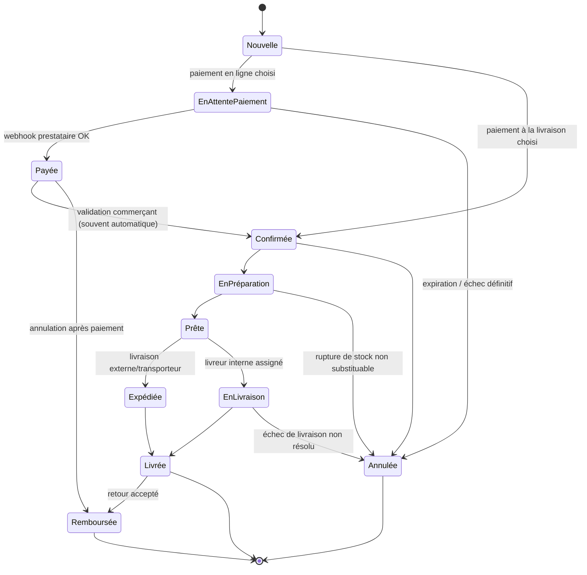

# 6. Parcours complet d'une commande

## 6.1 Diagramme d'états

## 6.2 Narratif détaillé

1. **Nouvelle** — Le client valide son panier. La commande est créée avec un `orderNumber` séquentiel (voir [04](04-schema-base-de-donnees.md#44-notes-dimplémentation)), le stock est **réservé** (`InventoryItem.reservedQuantity`) sans être décrémenté.
2. **En attente de paiement** — Si un moyen de paiement en ligne est choisi (Wave/OM/Free Money/carte via PayDunya ou PayTech), une intention de paiement est créée avec une `idempotencyKey`. Le client est redirigé vers la page de paiement du prestataire.
3. **Payée** — Uniquement déclenché par un **webhook vérifié** (jamais par le retour de redirection du navigateur, qui n'est qu'indicatif). Le stock réservé est décrémenté définitivement. La facture est générée automatiquement (voir [07](07-parcours-paiement-facture.md)).
4. **Confirmée** — Pour le paiement à la livraison, la commande passe directement ici après une validation (automatique ou manuelle selon la configuration du tenant — utile pour filtrer les commandes frauduleuses).
5. **En préparation** — Le commerçant ou un employé (`orders.update_status`) prépare la commande. Si une rupture de stock est découverte ici, l'employé peut annuler l'article concerné (déclenche une notification client) ou annuler la commande.
6. **Prête** — Prête pour enlèvement par un transporteur externe ou assignation à un livreur interne.
7. **Expédiée / En livraison** — Selon le mode choisi. Un livreur assigné (`Delivery`) peut mettre à jour son propre statut via son accès restreint.
8. **Livrée** — Preuve de livraison enregistrée (photo, signature ou code, voir [01](01-cahier-des-charges.md#livraison)). Si paiement à la livraison, l'encaissement est enregistré ici (`Delivery.codAmountCollected`) et déclenche la génération de la facture.
9. **Annulée** — Possible à plusieurs étapes tant que la commande n'est pas livrée. Libère le stock réservé. Si un paiement avait déjà été capturé, déclenche un remboursement (`Refund`) plutôt qu'une simple annulation.
10. **Remboursée** — Après livraison (retour accepté) ou après annulation d'une commande déjà payée. Génère un avoir (`CreditNote`) lié à la facture d'origine — la facture elle-même n'est jamais modifiée.

Chaque transition écrit une ligne `OrderStatusHistory` (`fromStatus`, `toStatus`, `changedBy`, `changedByType`, horodatage) — c'est la source de vérité pour l'historique affiché au commerçant et au client.

## 6.3 Cas particuliers

- **Rupture de stock pendant la préparation** : le système propose de substituer une variante, de rembourser partiellement la ligne, ou d'annuler la commande entière — jamais de décrémenter en négatif.
- **Commande multi-livreur non prévue en V1** : une commande est assignée à un seul livreur ; le fractionnement d'expédition est hors périmètre MVP.
- **Commande annulée par le client avant paiement** : simple libération du stock réservé, aucun impact comptable.
