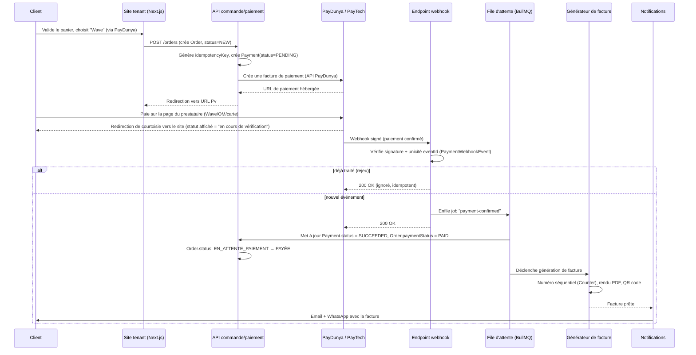

# 7. Parcours du paiement jusqu'à la facture

## 7.1 Diagramme de séquence — paiement en ligne

## 7.2 Étapes détaillées

1. **Création de l'intention de paiement** : dès que le client choisit un moyen en ligne, le serveur crée une ligne `Payment` (`status = PENDING`) avec une `idempotencyKey` unique **avant** tout appel au prestataire — un double clic du client ne peut jamais créer deux paiements pour la même commande (contrainte unique + vérification préalable).
2. **Appel au prestataire** : PayDunya ou PayTech selon la configuration active du tenant (`PaymentProviderConfig`). Le client saisit ses informations de paiement (numéro Wave/OM, carte) **exclusivement sur la page du prestataire** — YamaCommerce AI ne voit jamais ces données.
3. **Redirection de courtoisie** : le retour du navigateur vers le site après paiement n'est **jamais** traité comme une confirmation — il affiche seulement « paiement en cours de vérification ».
4. **Webhook** : seul canal de vérité. Vérification obligatoire de la signature/clé fournie par le prestataire. L'`eventId` du prestataire est stocké dans une contrainte unique (`PaymentWebhookEvent`) : un rejeu réseau (le prestataire peut renvoyer le même webhook plusieurs fois) est détecté et ignoré silencieusement côté métier (mais journalisé).
5. **Traitement asynchrone** : le endpoint webhook répond `200 OK` en quelques millisecondes après avoir simplement enfilé le job — la logique métier (mise à jour des statuts, génération de facture) s'exécute dans le worker, pour ne jamais faire attendre le prestataire et éviter un timeout qui provoquerait un renvoi inutile.
6. **Génération de la facture** : uniquement déclenchée par `Payment.status = SUCCEEDED` (ou par la validation d'une commande à paiement à la livraison une fois la livraison confirmée). Le numéro est attribué via le `Counter` transactionnel — aucune facture n'est générée deux fois pour la même commande (`Invoice.orderId` est unique).
7. **Finalisation** : une fois `finalizedAt` renseigné, la facture devient immuable. Un `integrityHash` (empreinte SHA-256 du contenu figé) permet de détecter toute altération. Le QR code encode un token de vérification (`qrCodeToken`) résolvant vers une page publique en lecture seule confirmant l'authenticité.
8. **Notification** : envoi email (pièce jointe PDF) et WhatsApp (lien de téléchargement) via la file `notifications`, selon les canaux activés par le tenant.

## 7.3 Paiement à la livraison (COD)

- L'`Order` passe directement à **Confirmée** sans `Payment` initial.
- Le livreur encaisse à la livraison ; la confirmation de livraison (`Delivery.codAmountCollected`) déclenche la création d'un `Payment` (`provider = "cod"`, `status = SUCCEEDED`) puis la génération de la facture, selon le **même pipeline** que le paiement en ligne (aucune divergence de logique de facturation entre les deux modes).
- Le rapprochement de la somme physiquement remise par le livreur à l'entreprise est suivi séparément via `DelivererRemittance`.

## 7.4 Paiement partiel et en tranches

- **Paiement partiel** : un `Payment` de type `partial` est autorisé si `sum(payments.amount pour cette commande) < order.total`. `Order.paymentStatus` passe à `PARTIAL`. La facture n'est **finalisée** qu'au paiement intégral, sauf configuration explicite « facture d'acompte » (`Invoice.type = deposit_invoice`), suivie d'une facture finale au solde.
- **Paiement en tranches** : un `InstallmentPlan` définit un échéancier (`Installment[]`). Chaque échéance payée crée un `Payment` lié ; le passage à `PAID` global de la commande n'intervient qu'à la dernière échéance soldée. Les échéances en retard (`status = overdue`) déclenchent une notification de relance.

## 7.5 Correction après finalisation

Une facture finalisée n'est **jamais** modifiée ni supprimée. Toute correction (erreur de montant, retour partiel, remise a posteriori) passe par un **avoir** (`CreditNote`) référençant la facture d'origine, avec son propre numéro séquentiel et son propre PDF.
