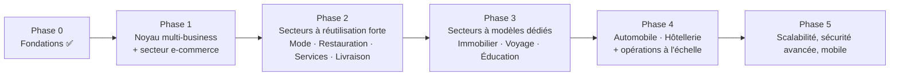

# 9. Plan de développement par phases

> Révisé pour l'architecture multi-business (voir [11](11-secteurs-et-modules.md) et [12](12-systeme-templates-et-direction-artistique.md)). La Phase 0 est livrée ; les phases 1+ sont replanifiées ci-dessous, avec un impact assumé sur le calendrier (voir [« Impact sur le calendrier »](#impact-sur-le-calendrier-comparaison-avec-le-plan-initial) plus bas).

## Phase 0 — Fondations ✅ (livrée)

Monorepo, multi-tenant + RLS, authentification, permissions, files d'attente, interface de paiement, chiffrement des identifiants marchand — voir le suivi dans [README.md](../README.md#état-de-la-phase-0-fondations).

## Phase 1 — Noyau multi-business + secteur e-commerce

**Objectif** : ne pas construire « un site e-commerce », mais **le moteur qui servira à tous les secteurs**, prouvé sur le premier secteur (e-commerce, celui déjà en partie couvert par la Phase 0).

1. ✅ **Registre secteurs/modules** — modèles `Sector`, `Module`, `TenantModule` migrés (`prisma/migrations/20260913000000_sector_module_registry_and_domain_extension`), seedés (10 secteurs + « Autre activité », catalogue de modules complet — voir [11 §11.7.1](11-secteurs-et-modules.md#1171--autre-activité--disponible-dès-la-phase-1)), logique d'activation (`activateSectorDefaults`, `setModuleEnabled`, `isModuleEnabled` dans `packages/database`) testée en isolation multi-tenant. Reste à faire : filtrer réellement la navigation/le dashboard par modules actifs (câblage `apps/web`, dépend du dashboard qui n'existe pas encore au-delà du placeholder Phase 0).
2. **Domaine personnalisé — assistant de configuration** (ajouté au périmètre le 13 septembre 2026) : modèle `Domain` étendu (statut de vérification, enregistrements DNS attendus/détectés, rappel, redirection sous-domaine → domaine personnalisé, achat par la plateforme, renouvellement — voir [04 §4.2](04-schema-base-de-donnees.md)) et migré ; `packages/domains` fournit déjà `computeExpectedDnsRecords()` et `isDomainAvailable()`. Restent à construire : l'assistant pas-à-pas dans le dashboard (saisie → enregistrements DNS → détection → activation TLS → domaine principal/redirection), la détection DNS périodique (job planifié), l'envoi de rappel, et les pages Super Admin (liste, statut DNS/SSL, suspension, relance, prix facturé, achat pour le client).
3. **Système de design tokens et composants réutilisables** — construit **avant** le premier template (couleurs de rôle, échelle d'espacement/typographie, rayons, ombres, tokens de mouvement ; composants `Button`/`Card`/`Badge`/`Section`/`EmptyState`/`Skeleton`/`ErrorState`, voir [12 §12.8](12-systeme-templates-et-direction-artistique.md#128-design-tokens-et-composants-réutilisables)).
4. **Registre de templates** : `SiteTemplate` par secteur, sélection à la création du tenant, structure page/composants déclarative (`pageManifest`/`componentManifest`).
5. **Éditeur visuel MVP — par sections configurables** (glisser-déposer de sections prédéfinies, pas de canvas libre — voir [12 §12.2](12-systeme-templates-et-direction-artistique.md#122-éditeur-visuel)) : logo, couleurs, polices, textes, images, ordre/activation des sections, paramètres d'animation, prévisualisation ordinateur/tablette/téléphone, brouillon → publication.
6. Authentification, permissions par rôle, dashboard commerçant (KPIs + export CSV) — hérité et complété depuis la Phase 0.
7. Gestion des produits (formulaire + import massif + assistant IA fiche produit avec brouillon obligatoire), clients, commandes (cycle complet, voir [06](06-parcours-commande.md)).
8. Paiements : PayDunya réel (sandbox → live), paiement à la livraison, webhook vérifié + idempotence (déjà architecturé en Phase 0, câblé ici dans le parcours d'achat réel), toujours via l'interface `PaymentProviderAdapter`.
9. Facturation PDF séquentielle + QR code + envoi email.
10. Livraison de base : zones tarifaires, assignation manuelle, preuve de livraison photo.
11. **Trois templates e-commerce réellement différents et complets** (accueil, listes, détail, formulaires, espace client, navigation mobile, états vides/chargement/erreur, animations, données de démonstration, captures ordinateur + mobile — voir la checklist de complétude [12 §12.9](12-systeme-templates-et-direction-artistique.md#129-checklist-de-complétude-dun-template)), avec les 3 niveaux d'animation (discret/dynamique/immersif). Les 3 déclinaisons seront proposées à la validation avant construction.

**Critère de sortie** : un même moteur sert 3 templates visuellement très différents sans code spécifique par template (seule la configuration change) ; les 7 critères d'acceptation du [cahier des charges §1.9](01-cahier-des-charges.md#19-critères-dacceptation-du-mvp) sont vérifiés ; le test réel d'isolation RLS (y compris `TenantModule`) passe en CI.

## Phase 2 — Secteurs à réutilisation forte du noyau commerce

Secteurs qui réutilisent le catalogue/commande existant avec des modules additionnels plutôt que de nouvelles primitives de données :

- **Mode et vêtements** : variantes avancées (taille/couleur/matière), guide des tailles, lookbook, comptes revendeurs, IA (amélioration/suppression de fond, suggestions de tenues).
- **Restauration** : menu numérique, réservation de table, commande par QR code, suivi de préparation.
- **Salons et prestataires de services** : catalogue de prestations, rendez-vous, calendrier, disponibilité des employés — première brique du module `appointments` (réutilisé en Phase 3 par l'automobile et l'hôtellerie).
- **Livraison** (secteur dédié) : dispatch, suivi livreur temps réel, réconciliation COD.
- Agent IA conversationnel complet sur le dashboard (function calling), IA adaptée à chaque secteur ci-dessus.
- WhatsApp Business Cloud API complète (par tenant, notifications + factures), SMS transactionnel.
- Fidélité, parrainage, codes promo, cartes-cadeaux, campagnes email/WhatsApp, relance panier abandonné.
- Deuxième prestataire de paiement (PayTech) actif en parallèle de PayDunya.

**Critère de sortie** : 4 secteurs supplémentaires opérationnels, le module `appointments` posé et déjà réutilisé deux fois (services + restauration).

## Phase 3 — Secteurs à modèles de données dédiés

Secteurs nécessitant les primitives génériques `Listing`/`Reservation` et leurs tables d'extension typées (voir [04 §4.5.2](04-schema-base-de-donnees.md#452-primitives-génériques--architecture-hybride)) et, pour l'immobilier et l'éducation, des tables propres supplémentaires :

- **Immobilier** : biens, baux, quittances automatiques, cautions, relances impayés, états des lieux, maintenance, portails propriétaire/locataire, carte interactive, IA (annonces + rentabilité).
- **Agences de voyage** : circuits/forfaits, calendrier des départs, demandes de visa avec upload sécurisé (module transverse `regulated_documents`), liste de voyageurs, paiement en plusieurs tranches (UI complète), IA (itinéraires, recommandations).
- **Écoles et centres de formation** : inscriptions, classes, présences, résultats, portails étudiant/parent, certificats, paiement en tranches.
- **Éditeur visuel avancé** : historique des versions, annulation/restauration, publication programmée, duplication de pages (`TenantSiteVersion`, voir [04 §4.5.7](04-schema-base-de-donnees.md#457-éditeur-visuel--versioning)).

**Critère de sortie** : les primitives génériques `Listing`/`Reservation` servent 3 secteurs différents sans duplication de logique de présentation (adaptateur `toCardItem()` vérifié sur les 3).

## Phase 4 — Automobile, hôtellerie et opérations à l'échelle

- **Automobile** : catalogue véhicules (`Listing`), suivi d'importation, rendez-vous d'essai, gestion des prospects.
- **Hôtellerie et locations** : chambres/logements (`Listing` + `ListingAvailability`), calendrier de disponibilité, ménage, avis clients.
- Couverture explicite des « autres activités » ([11 §11.5](11-secteurs-et-modules.md#115--autres-activités--couverture-sans-nouveau-secteur)) : validation concrète sur au moins 2 cas (ex. pharmacie via `ecommerce` + `regulated_documents`, garage via `services` + `automobile`).
- **Création de secteur sans code par le Super Admin** ([11 §11.7.2](11-secteurs-et-modules.md#1172-création-dun-nouveau-secteur-par-le-super-admin--sans-toucher-au-code)) : formulaire d'administration (nom, icône, vocabulaire, modules par défaut/facultatifs, templates compatibles, pages proposées, champs personnalisés), livré une fois le registre éprouvé sur les 10 secteurs système.
- Multi-boutique/entrepôt, fournisseurs/achats, marge par produit.
- Portail livreur dédié, remises d'argent, réconciliation COD avancée.
- Domaine personnalisé en libre-service, TLS automatique de bout en bout.
- Facturation plateforme automatisée (abonnement + commissions).
- Rapports avancés multi-période.

## Phase 5 — Scalabilité, sécurité avancée et mobile

- Durcissement sécurité (audit externe, tests de pénétration, rotation des secrets, dénormalisation `tenantId` sur les tables enfants encore non couvertes par RLS — voir la migration `enable_row_level_security` de la Phase 0).
- Observabilité avancée, alerting proactif sur incidents de paiement.
- Cache/lecture répliquée si le volume l'exige ; réévaluation du schéma-par-tenant pour la formule Entreprise.
- API `v1` ouverte pour une application mobile.
- Internationalisation complète EN/Wolof (contenu, pas seulement architecture).

## Impact sur le calendrier (comparaison avec le plan initial)

|                                            | Plan initial (avant cette demande)                                         | Plan révisé                                                                                                                                                                                              |
| ------------------------------------------ | -------------------------------------------------------------------------- | -------------------------------------------------------------------------------------------------------------------------------------------------------------------------------------------------------- |
| Phase 1 (MVP)                              | 1 secteur figé (e-commerce), 1 template                                    | Moteur générique (registre secteur/module/template) + éditeur visuel + 1 secteur × 3 templates — **charge sensiblement plus lourde**, car il faut construire l'abstraction avant sa première utilisation |
| Nombre de phases avant couverture complète | 4                                                                          | 6 (0 à 5)                                                                                                                                                                                                |
| Secteurs couverts avant la Phase 4         | 0 (Phase 2 seulement, en réutilisant un moteur déjà figé sur l'e-commerce) | 8 sur 10 (e-commerce dès la Phase 1, 4 de plus en Phase 2, 3 de plus en Phase 3)                                                                                                                         |

**Conséquence assumée** : la Phase 1 sera plus longue que dans le plan initial, parce qu'elle porte la construction du registre secteurs/modules/templates et de l'éditeur visuel — un investissement structurel, pas une fonctionnalité de plus. En contrepartie, chaque secteur ajouté à partir de la Phase 2 est **beaucoup moins coûteux** que si chaque secteur avait nécessité sa propre application (ce que l'architecture interdit explicitement, voir [02 §2.4](02-architecture-fonctionnelle.md#24-architecture-multi-business--noyau-modules-secteurs-templates)).

Sans outil de suivi de vélocité réel sur cette équipe, ce document ne fixe pas de dates calendaires — seulement un ordre et une taille relative. Une estimation en jours/semaines pourra être posée une fois l'équipe et son rythme connus.

## Méthode de livraison à chaque étape

Pour chaque fonctionnalité listée ci-dessus, la livraison inclut systématiquement : fichiers complets avec leur emplacement, commandes d'installation, variables d'environnement documentées, migrations Prisma, tests essentiels, vérification TypeScript, et instructions de test manuel — sans passer à l'élément suivant sans confirmation, conformément à la méthode de travail demandée.
