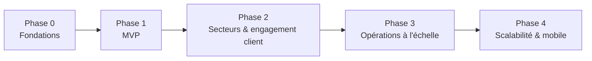

# 9. Plan de développement par phases

## Phase 0 — Fondations (avant tout code métier)

**Objectif** : socle technique prêt, aucune fonctionnalité métier encore.

- Initialisation du monorepo (pnpm + Turborepo), voir [10](10-structure-dossiers.md).
- Configuration Docker (Postgres, Redis, app web, worker).
- Schéma Prisma initial (voir [04](04-schema-base-de-donnees.md)) + migration + activation RLS.
- Auth.js configuré (comptes User + sessions), squelette 2FA.
- Design system de base (tokens Tailwind, thème clair/sombre, composants shadcn/ui installés).
- Middleware de résolution de tenant par domaine (voir [03](03-architecture-technique.md#33-résolution-du-tenant-par-domaine)).
- CI (lint, typecheck, tests) sur chaque pull request.

**Critère de sortie** : un `docker compose up` fait tourner l'app, la base migrée, un tenant de démonstration accessible sur un sous-domaine local, l'auth fonctionnelle.

## Phase 1 — MVP (périmètre demandé)

**Objectif** : premier parcours marchand-client complet et vendable.

1. Authentification (login, 2FA de base, reset mot de passe).
2. Architecture multi-tenant opérationnelle (isolation vérifiée par tests).
3. Super Admin : création/suspension de tenant, attribution de formule, vue liste.
4. Dashboard commerçant : KPIs principaux + au moins un graphique interactif + export CSV.
5. Gestion des produits (formulaire manuel) + variantes + catégories.
6. Import massif (CSV/Excel) en file d'attente avec rapport d'erreurs.
7. Assistant IA fiche produit à partir d'une photo (pipeline brouillon → validation).
8. Gestion des clients (création, historique).
9. Commandes : cycle complet des statuts + historique (voir [06](06-parcours-commande.md)).
10. Paiements : architecture adaptateur + intégration réelle **PayDunya** (ou **PayTech**, à trancher selon l'accès marchand obtenu en premier) + paiement à la livraison. Vérification webhook + idempotence effectives (pas de simulation).
11. Facture PDF automatique + numérotation séquentielle + QR code + envoi email.
12. Livraison : zones tarifaires simples + assignation manuelle + preuve de livraison basique (photo).
13. Paramètres entreprise (branding, moyens de paiement activés, notifications de base).
14. Un template de site e-commerce premium, responsive, avec mode clair/sombre.

**Critère de sortie** : les 7 critères d'acceptation de la section 1.9 du [cahier des charges](01-cahier-des-charges.md#19-critères-dacceptation-du-mvp) sont vérifiés par des tests automatisés + une recette manuelle documentée.

## Phase 2 — Extension sectorielle & engagement client

- Templates de site pour les autres secteurs (restaurant, immobilier, automobile, salon, hôtel, école, services, livraison, grossiste) réutilisant le moteur commun.
- Agent IA conversationnel complet sur le dashboard (function calling sur les données du tenant).
- Fidélité, parrainage, codes promo, cartes-cadeaux, comptes revendeurs/prix de gros.
- Campagnes email/WhatsApp, relance de panier abandonné automatisée.
- Intégration WhatsApp Business Cloud API complète (factures + notifications transactionnelles).
- SMS transactionnel (OTP, notifications critiques).
- Deuxième prestataire de paiement actif en parallèle (bascule/priorité configurable par le tenant).

## Phase 3 — Opérations à l'échelle

- Multi-boutique / multi-entrepôt avec transferts de stock.
- Fournisseurs, achats/approvisionnements, calcul de marge par produit.
- Application/portail livreur dédié + remises d'argent + réconciliation COD.
- Paiement en tranches (UI complète côté client et suivi côté commerçant).
- Domaine personnalisé en libre-service avec TLS automatique de bout en bout (sans intervention Super Admin).
- Facturation plateforme automatisée (abonnement + commissions), page Super Admin correspondante.
- Rapports avancés (comparaisons multi-période, exports Excel enrichis, performance par zone).

## Phase 4 — Scalabilité, sécurité avancée & mobile

- Durcissement sécurité (audit externe, tests de pénétration, rotation des secrets). Inclut la dénormalisation d'une colonne `tenantId` sur les tables enfants qui n'en portent pas encore (`OrderItem`, `ProductVariant`, `InventoryItem`, etc. — voir la migration `enable_row_level_security` de la Phase 0) pour leur appliquer directement une policy RLS, plutôt que de dépendre uniquement de l'accès via leur table parente.
- Observabilité avancée (traces, métriques, alerting proactif sur incidents de paiement).
- Cache/lecture répliquée si le volume de tenants le justifie ; réévaluation éventuelle du schéma-par-tenant pour la formule Entreprise (voir [03](03-architecture-technique.md#32-stratégie-multi-tenant)).
- Ouverture officielle de l'API `v1` pour une application mobile (React Native) consommant les mêmes endpoints que le dashboard web.
- Internationalisation complète EN / Wolof (le MVP prépare uniquement l'architecture i18n, sans traduire tout le contenu).
- Éditeur de thème/page builder avancé pour les tenants formule Premium/Entreprise.

## Méthode de livraison à chaque étape de la Phase 1

Pour chaque fonctionnalité listée ci-dessus, la livraison inclura systématiquement : fichiers complets avec leur emplacement, commandes d'installation, variables d'environnement documentées, migrations Prisma, tests essentiels, vérification TypeScript, et instructions de test manuel — sans passer à l'élément suivant sans confirmation, conformément à la méthode de travail demandée.
