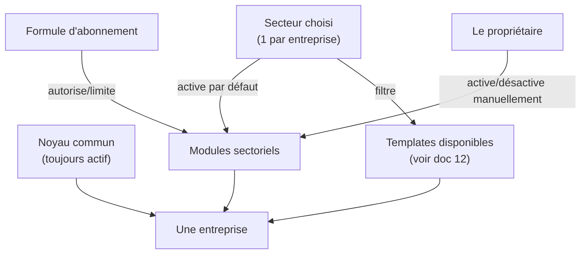

# 11. Secteurs et modules — architecture multi-business

> Ce document remplace la logique « un type d'entreprise = un template figé » posée initialement en [02](02-architecture-fonctionnelle.md#24-modèles-de-site-par-secteur). La plateforme est désormais **un noyau commun + un catalogue de modules activables + un registre de secteurs + un registre de templates**. Aucun secteur n'est une application séparée.

## 11.1 Principe

- Une entreprise choisit **un secteur** à la création (son métier principal). Le secteur active un **jeu de modules par défaut**.
- Chaque module peut ensuite être activé/désactivé individuellement, dans les limites de la formule d'abonnement (`Plan.includedModules`, voir [04](04-schema-base-de-donnees.md#45-extension-multi-secteurs)).
- Le dashboard, la navigation et les permissions d'un tenant n'affichent **que** les modules réellement actifs pour lui — jamais un module désactivé, même grisé.
- Un module est soit **core** (fourni à tout le monde, non désactivable), soit **sectoriel** (rattaché à un ou plusieurs secteurs, activable/désactivable).

## 11.2 Modules du noyau commun (`category = core`)

| Clé de module   | Contenu                                                                                         |
| --------------- | ----------------------------------------------------------------------------------------------- |
| `auth`          | Authentification, 2FA, sessions, réinitialisation de mot de passe                               |
| `businesses`    | Gestion de l'entreprise elle-même (profil, branding, cycle de vie tenant)                       |
| `customers`     | Comptes clients, historique, adresses, segmentation                                             |
| `employees`     | Employés, rôles, permissions, journal d'audit                                                   |
| `payments`      | Interface `PaymentProviderAdapter`, moyens de paiement, idempotence, webhooks                   |
| `invoicing`     | Factures, devis, reçus, bons de livraison, avoirs, numérotation séquentielle                    |
| `emails`        | Modèles et envoi transactionnel (Resend)                                                        |
| `whatsapp`      | Connexion WhatsApp Business par tenant, notifications, envoi de factures                        |
| `ai`            | Assistant fiches produit/annonces, agent conversationnel, quotas par formule                    |
| `subscriptions` | Formule, cycle de facturation plateforme, commissions                                           |
| `domains`       | Sous-domaine, domaine personnalisé, TLS (voir `packages/domains`)                               |
| `visual_editor` | Éditeur de site (voir [12](12-systeme-templates-et-direction-artistique.md#122-éditeur-visuel)) |
| `files`         | Stockage et gestion des fichiers (Cloudflare R2), images/vidéos                                 |
| `analytics`     | Tableau de bord, rapports, exports                                                              |
| `settings`      | Paramètres généraux (locale, devise, fuseau horaire, notifications)                             |

## 11.3 Registre des secteurs (final)

| #   | Secteur (clé)   | Nom affiché                          | Modules sectoriels activés par défaut                                                    |
| --- | --------------- | ------------------------------------ | ---------------------------------------------------------------------------------------- |
| 1   | `ecommerce`     | Boutiques, commerçants et grossistes | `catalog`, `inventory`, `delivery_zones`, `wholesale_pricing`                            |
| 2   | `fashion`       | Mode et vêtements                    | `catalog`, `inventory`, `variants_advanced`, `lookbook`, `delivery_zones`                |
| 3   | `restaurant`    | Restauration                         | `catalog` (menu), `table_reservations`, `qr_ordering`, `delivery_zones`                  |
| 4   | `real_estate`   | Immobilier                           | `listings`, `leases`, `rent_collection`, `property_maintenance`, `visit_requests`, `map` |
| 5   | `travel_agency` | Agences de voyage                    | `listings` (circuits/forfaits), `departures`, `visa_requests`, `traveler_documents`      |
| 6   | `automobile`    | Automobile                           | `listings` (véhicules), `import_tracking`, `test_drive_appointments`, `leads`            |
| 7   | `hospitality`   | Hôtels et locations                  | `listings` (chambres/logements), `availability_calendar`, `housekeeping`                 |
| 8   | `services`      | Salons et prestataires de services   | `service_catalog`, `appointments`, `staff_availability`                                  |
| 9   | `education`     | Écoles et centres de formation       | `courses`, `enrollments`, `academic_tracking`, `student_portal`, `parent_portal`         |
| 10  | `delivery`      | Services de livraison                | `dispatch`, `delivery_zones`, `deliverer_tracking`, `cod_reconciliation`                 |

Tout secteur peut activer en plus n'importe quel module d'un autre secteur si pertinent (ex. un hôtel qui active `catalog` pour vendre des produits en boutique annexe) — les modules ne sont pas cloisonnés, seuls les **défauts** le sont.

## 11.4 Modules sectoriels en détail

### 11.4.1 Immobilier (`real_estate`)

| Module                                      | Fonctions couvertes                                                                                                                     |
| ------------------------------------------- | --------------------------------------------------------------------------------------------------------------------------------------- |
| `listings`                                  | Immeubles, appartements, maisons, terrains, locaux ; vente et location ; disponibilité ; photos/vidéos/localisation ; carte interactive |
| `leases`                                    | Contrats de location, gestion des propriétaires et locataires, portails propriétaire/locataire                                          |
| `rent_collection`                           | Échéances et paiements de loyers, quittances automatiques, cautions, relances automatiques des impayés                                  |
| `property_maintenance`                      | États des lieux, maintenance et réparations, gestion des dépenses par bien, rentabilité par bien                                        |
| `visit_requests`                            | Demandes de visite, attribution des agents, commissions                                                                                 |
| `ai.real_estate` (extension du module `ai`) | Création d'annonces, analyse de rentabilité                                                                                             |

### 11.4.2 Agences de voyage (`travel_agency`)

| Module                      | Fonctions couvertes                                                                                         |
| --------------------------- | ----------------------------------------------------------------------------------------------------------- |
| `listings`                  | Destinations, circuits, forfaits, hôtels partenaires, excursions, omra/voyages religieux, voyages de groupe |
| `departures`                | Calendrier des départs, places disponibles, options et suppléments                                          |
| `visa_requests`             | Demande de visa, téléversement sécurisé des documents                                                       |
| `traveler_documents`        | Liste des voyageurs, bons de voyage, notifications avant départ                                             |
| `payments` (extension)      | Devis, réservations, paiement complet ou en tranches, annulations/remboursements                            |
| `ai.travel`                 | Recommandations de destinations, création de descriptions et d'itinéraires                                  |
| `whatsapp` (usage renforcé) | Assistance voyageur                                                                                         |

### 11.4.3 Mode et vêtements (`fashion`)

| Module                          | Fonctions couvertes                                                                    |
| ------------------------------- | -------------------------------------------------------------------------------------- |
| `catalog` + `variants_advanced` | Tailles, couleurs, matières, stock par variante, images par couleur, guide des tailles |
| `lookbook`                      | Collections, nouveautés, looks complets, produits associés                             |
| `wholesale_pricing`             | Vente en gros/détail, comptes revendeurs                                               |
| `loyalty_promo`                 | Favoris, précommandes, codes promo, avis, fidélité                                     |
| `ai.fashion`                    | Fiches produits par photo, amélioration/suppression de fond, suggestions de tenues     |

### 11.4.4 Restauration (`restaurant`)

| Module               | Fonctions couvertes                                                 |
| -------------------- | ------------------------------------------------------------------- |
| `catalog` (menu)     | Plats, catégories, suppléments, disponibilité des plats, promotions |
| `table_reservations` | Réservation de table                                                |
| `qr_ordering`        | Commande par QR code à table                                        |
| `delivery_zones`     | Livraison ou retrait                                                |
| `order_tracking`     | Suivi de préparation (extension de `OrderStatusHistory`)            |
| `loyalty_promo`      | Fidélité                                                            |

### 11.4.5 Automobile (`automobile`)

| Module                    | Fonctions couvertes                                                                  |
| ------------------------- | ------------------------------------------------------------------------------------ |
| `listings` (véhicules)    | Catalogue, recherche marque/modèle/année, statut (disponible/en transit/sous douane) |
| `leads`                   | Demande personnalisée, comparaison, simulation de coûts, gestion des prospects       |
| `import_tracking`         | Suivi de l'importation, documents et contrats                                        |
| `test_drive_appointments` | Rendez-vous et essais                                                                |
| `payments` (extension)    | Réservation, acompte                                                                 |

### 11.4.6 Hôtels et locations (`hospitality`)

| Module                          | Fonctions couvertes                                 |
| ------------------------------- | --------------------------------------------------- |
| `listings` (chambres/logements) | Calendrier des disponibilités, prix selon les dates |
| `availability_calendar`         | Réservations, services supplémentaires              |
| `housekeeping`                  | Check-in/check-out, gestion du ménage               |
| `invoicing` (extension)         | Facturation                                         |
| `reviews`                       | Avis clients                                        |

### 11.4.7 Salons et prestataires de services (`services`)

| Module                  | Fonctions couvertes                                            |
| ----------------------- | -------------------------------------------------------------- |
| `service_catalog`       | Catalogue de services, durée et prix des prestations, forfaits |
| `appointments`          | Rendez-vous, calendrier, rappels                               |
| `staff_availability`    | Disponibilité des employés                                     |
| `payments` (extension)  | Paiement ou acompte                                            |
| `customers` (extension) | Historique des clients                                         |

Ce module couvre aussi, par composition (voir §11.5) : cabinets médicaux, pharmacies, garages, consultants, artisans, agences événementielles, services professionnels.

### 11.4.8 Écoles et centres de formation (`education`)

| Module                             | Fonctions couvertes                                               |
| ---------------------------------- | ----------------------------------------------------------------- |
| `courses`                          | Formations, classes, calendrier                                   |
| `enrollments`                      | Inscriptions, paiements en plusieurs tranches, factures, relances |
| `academic_tracking`                | Présences, résultats                                              |
| `student_portal` / `parent_portal` | Portails dédiés                                                   |
| `documents`                        | Documents et attestations                                         |

### 11.4.9 Livraison (`delivery`)

Reprend et étend le module `delivery` déjà défini en Phase 0/1 ([01](01-cahier-des-charges.md#livraison)) : zones tarifaires, attribution livreur, preuve de livraison, encaissement COD, historique des remises — mais devient ici un **secteur** à part entière pour les entreprises dont le cœur de métier est la livraison elle-même (coursiers, flotte dédiée), avec un module `dispatch` (répartition des courses en temps réel) en plus.

## 11.5 « Autres activités » — couverture sans nouveau secteur

Ces activités listées par l'entrepreneur ne nécessitent **aucun secteur ni module supplémentaire** : elles se composent à partir des secteurs/modules existants.

| Activité demandée                                            | Se compose de                                                                                                  |
| ------------------------------------------------------------ | -------------------------------------------------------------------------------------------------------------- |
| Cabinets médicaux                                            | `services` + `appointments` + module additionnel `regulated_documents` (ordonnances/dossiers, accès restreint) |
| Pharmacies                                                   | `ecommerce` (`catalog`) + `regulated_documents` (ordonnances)                                                  |
| Garages                                                      | `services` (`appointments`) + `automobile` (`listings` en option pour les véhicules d'occasion en vente)       |
| Services de livraison                                        | secteur `delivery`                                                                                             |
| Agences événementielles                                      | `services` + `listings` (salles/prestations) + `appointments`                                                  |
| Entreprises de construction                                  | `services` + devis/factures d'acompte (déjà dans `invoicing`)                                                  |
| Boutiques électroniques, électroménager, mobilier/décoration | `ecommerce`                                                                                                    |
| Grossistes                                                   | `ecommerce` + `wholesale_pricing`                                                                              |
| Hôtels, restaurants, locations de véhicules                  | secteurs dédiés existants (`hospitality`, `restaurant`, `automobile`)                                          |
| Commerçants                                                  | `ecommerce`                                                                                                    |
| Consultants, artisans, services professionnels               | `services`                                                                                                     |
| Associations                                                 | `services` + `customers` (membres) — cotisations via `payments`/`invoicing`                                    |
| Import-export                                                | `ecommerce` + `wholesale_pricing` + `listings` en option                                                       |

Le module `regulated_documents` (nouveau, léger) est le seul ajout réel nécessaire : upload sécurisé + visibilité restreinte d'un document lié à une commande/rendez-vous — utile à la fois pour les pharmacies/cabinets médicaux et pour les demandes de visa (`travel_agency`), donc mutualisé.

## 11.6 Règle de gouvernance des modules

1. À la création du tenant, le Super Admin (ou l'entrepreneur en auto-inscription, Phase 2+) choisit **un secteur**.
2. Le secteur active ses modules par défaut (`TenantModule.isEnabled = true`, `source = "sector_default"`).
3. Le propriétaire peut activer d'autres modules disponibles dans sa formule (`source = "manual"`), ou en désactiver certains (jamais un module `core`).
4. Un module désactivé disparaît entièrement de la navigation, du dashboard et des permissions proposées aux employés — pas seulement caché visuellement.
5. Changer de secteur après coup est possible (rare) : cela ne supprime aucune donnée, seulement les modules par défaut proposés changent ; les données déjà créées par un module désactivé restent en base et redeviennent visibles si le module est réactivé.

## 11.7 Secteur personnalisé et création de secteur sans code

Deux niveaux, livrés à des moments différents du plan ([09](09-plan-developpement.md)), pour ne jamais limiter la plateforme aux 10 secteurs initiaux :

### 11.7.1 « Autre activité » — disponible dès la Phase 1

Un onzième choix à la création du tenant, `key = "custom"`, qui n'active **aucun module par défaut** : l'entrepreneur compose lui-même son site en activant librement des modules existants (`catalog`, `listings`, `appointments`, `service_catalog`…) parmi ceux déjà catalogués. Aucun développement supplémentaire n'est requis pour ce premier niveau — c'est une conséquence directe du fait que `TenantModule.source` accepte déjà `"manual"` (voir §11.6).

### 11.7.2 Création d'un nouveau secteur par le Super Admin — sans toucher au code

Fonctionnalité d'administration (Phase 4, une fois le registre éprouvé sur les 10 secteurs réels) permettant de déclarer un **nouveau** `Sector` entièrement via formulaire, sans déploiement :

| Champ saisi par le Super Admin                                      | Persisté dans                                                                                                                                                                                                             |
| ------------------------------------------------------------------- | ------------------------------------------------------------------------------------------------------------------------------------------------------------------------------------------------------------------------- |
| Nom du secteur                                                      | `Sector.name`                                                                                                                                                                                                             |
| Icône                                                               | `Sector.iconKey`                                                                                                                                                                                                          |
| Vocabulaire (ex. « Catalogue » → « Biens », « Produit » → « Bien ») | `Sector.vocabulary` (clé → libellé, consommé par l'i18n de l'interface)                                                                                                                                                   |
| Modules par défaut                                                  | `Sector.defaultModuleKeys` (choisis parmi le catalogue `Module` existant)                                                                                                                                                 |
| Modules facultatifs proposés                                        | `Sector.optionalModuleKeys`                                                                                                                                                                                               |
| Templates compatibles                                               | `Sector.compatibleTemplateTags` (filtre les `SiteTemplate` proposés à ce secteur)                                                                                                                                         |
| Pages proposées                                                     | `Sector.proposedPageManifest` (référence des types de page du §12.6 à activer)                                                                                                                                            |
| Champs personnalisés                                                | `Sector.customFieldSchema` (schéma validant les attributs variables des `Listing` de ce secteur — voir contrainte de typage au [04 §4.5.2](04-schema-base-de-donnees.md#452-primitives-génériques--architecture-hybride)) |

Contrainte structurante : un secteur créé ainsi **ne peut composer qu'à partir de modules et de types de page déjà existants** — il ne génère jamais de nouvelle table ni de nouveau composant de rendu. C'est ce qui garantit qu'aucun code n'est nécessaire : le moteur générique (modules + primitives `Listing`/`Reservation` + adaptateur `toCardItem()`, voir [12 §12.7](12-systeme-templates-et-direction-artistique.md#127-conséquences-pour-le-noyau-de-rendu)) est le même, seule la configuration change. Un métier qui a besoin d'une donnée réellement structurante et récurrente (comme l'immobilier ou l'éducation) reste éligible à devenir un secteur « système » avec ses propres tables dédiées — décision produit, pas une limite technique.
