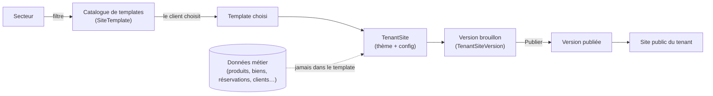

# 12. Système de templates, éditeur visuel et direction artistique

## 12.1 Architecture du système de templates

**Principe clé : le template ne contient jamais de données métier.** Un `SiteTemplate` définit une structure de pages, des composants et une direction artistique ; les données réelles (produits, biens immobiliers, réservations, clients, commandes) vivent dans les tables du noyau/modules, complètement indépendantes. Conséquence directe : **changer de template ne fait jamais perdre une donnée** — seul l'habillage (`TenantSite` + ses `Page`) change.

- `SiteTemplate` : un template appartient à **un secteur** (ou à `generic` pour un usage transverse), porte une `artDirectionKey`, un `pageManifest` (liste des pages qu'il fournit) et un `componentManifest` (blocs disponibles).
- Chaque secteur propose **au moins 3 templates réellement différents** (structure, direction artistique, composants) — jamais une simple recoloration.
- `TenantSite` référence le template actif + la configuration de thème (couleurs, polices, mode clair/sombre par défaut, **intensité d'animation**).
- `TenantSiteVersion` porte l'historique : chaque publication crée une nouvelle version horodatée, permettant annulation/restauration et publication programmée (voir §12.2).

## 12.2 Éditeur visuel

### Ce que le propriétaire peut modifier

Logo · couleurs · polices · textes · images · vidéos · arrière-plans · espacements · boutons · cartes · animations (par section) · ordre des sections · visibilité des sections · en-tête · pied de page — avec **prévisualisation séparée ordinateur / tablette / téléphone**.

### Mécanique

| Fonction                      | Implémentation                                                                                                                                                                                                                     |
| ----------------------------- | ---------------------------------------------------------------------------------------------------------------------------------------------------------------------------------------------------------------------------------- |
| Glisser-déposer               | Réordonnancement du tableau `blocks` d'une `Page`, position recalculée côté client puis persistée                                                                                                                                  |
| Prévisualisation en direct    | Rendu de la version **brouillon** sur une route dédiée non indexée (`?preview=<versionId>`), jamais visible publiquement                                                                                                           |
| Brouillons                    | Toute modification écrit dans la `TenantSiteVersion` de statut `draft` — jamais directement dans la version `published`                                                                                                            |
| Historique / Annuler-rétablir | Chaque sauvegarde de brouillon crée un point d'historique (`TenantSiteVersionSnapshot`, voir [04](04-schema-base-de-donnees.md#45-extension-multi-secteurs)) ; annuler = restaurer un snapshot antérieur dans le brouillon courant |
| Publication programmée        | `TenantSiteVersion.status = "scheduled"` + `scheduledAt` ; un job planifié (file `invoices`-like, nouvelle file `site-publishing`) promeut la version à l'heure prévue                                                             |
| Duplication de page           | Copie profonde d'une `Page` (et de ses blocs) dans la même version, avec un nouveau slug                                                                                                                                           |

### Niveaux d'animation

| Niveau                     | Comportement                                                                                                  |
| -------------------------- | ------------------------------------------------------------------------------------------------------------- |
| **Discret**                | Apparitions au défilement en fondu simple, pas de parallaxe, survols minimaux — priorité absolue à la vitesse |
| **Dynamique** (par défaut) | Apparitions au défilement + transitions de page + effets de survol + carrousels animés                        |
| **Immersif**               | Ajoute parallaxe subtil, galeries immersives, compteurs animés, micro-interactions détaillées                 |

Réglable globalement (`TenantSite.themeConfig.animationIntensity`) et section par section (override par bloc). Dans tous les cas : `prefers-reduced-motion` est respecté et désactive automatiquement les effets non essentiels, quel que soit le niveau choisi.

## 12.3 Règles de design premium (toutes sections, tous secteurs)

- Page d'accueil à fort impact : grand visuel/héro, proposition de valeur claire, preuve sociale (avis/chiffres), appel à l'action net.
- Cohérence typographique : une police d'accroche (titres) + une police de lecture (texte), jamais plus de deux familles.
- Grande image optimisée (AVIF/WebP, tailles responsives, `loading="lazy"` hors héro) plutôt que plusieurs petites.
- Espacement généreux et rythmé (pas de sections collées), cartes à ombre légère et coins cohérents avec la direction artistique.
- Pages intérieures aussi soignées que l'accueil — jamais de page catalogue/detail traitée comme un formulaire brut.
- États de chargement (skeletons adaptés à la mise en page réelle, pas un rectangle générique), états vides illustrés avec une action proposée, erreurs formulées sans jargon technique.

## 12.4 Performance et accessibilité (contrainte transversale, non négociable)

- Animations exclusivement via `transform`/`opacity` (jamais `top/left/width` animés) pour rester à 60 fps.
- Images/vidéos : formats modernes, dimensions adaptées, chargement différé hors zone visible initiale.
- Core Web Vitals ciblés : LCP < 2,5 s, CLS < 0,1, INP < 200 ms sur un mobile milieu de gamme en 3G/4G sénégalaise.
- SEO : balises sémantiques, méta-données par page, données structurées (Product/LocalBusiness/Event selon secteur), sitemap généré par tenant.
- Accessibilité : contraste AA, navigation clavier complète de l'éditeur ET du site public, `aria-*` sur les composants interactifs, animations désactivables indépendamment de l'intensité choisie.

## 12.5 Direction artistique par secteur

Trois propositions par secteur détaillé. Un propriétaire choisit une proposition à l'installation du template (personnalisable ensuite dans l'éditeur).

### Immobilier

| Proposition                                     | Ambiance            | Palette                           | Typographie                               | Élément signature                                                                 |
| ----------------------------------------------- | ------------------- | --------------------------------- | ----------------------------------------- | --------------------------------------------------------------------------------- |
| **Immobilier de luxe**                          | Feutré, éditorial   | Noir/ivoire + touche or           | Serif élégante (titres) + sans-serif fine | Plein écran plein cadre en héro, galerie biens en grand format                    |
| **Agence moderne**                              | Confiance, clarté   | Bleu profond + blanc + accent vif | Sans-serif géométrique                    | Recherche multicritère proéminente dès le héro, carte interactive intégrée        |
| **Gestion locative / propriétaire indépendant** | Pratique, rassurant | Vert sauge + gris chaud           | Sans-serif humaniste                      | Tableau de bord orienté chiffres visible dès l'accueil (biens, loyers, échéances) |

### Agences de voyage

| Proposition                          | Ambiance               | Palette                   | Typographie        | Élément signature                                               |
| ------------------------------------ | ---------------------- | ------------------------- | ------------------ | --------------------------------------------------------------- |
| **Agence premium**                   | Évasion, aspirationnel | Bleu outremer + sable     | Serif de caractère | Héro vidéo/parallaxe destination, cartes de circuits immersives |
| **Billetterie / voyages d'affaires** | Efficace, direct       | Blanc + bleu vif          | Sans-serif dense   | Barre de recherche/réservation figée en haut de page            |
| **Omra et pèlerinage**               | Sobre, spirituel       | Vert profond + or discret | Serif calme        | Calendrier des départs mis en avant, ton et iconographie dédiés |

### Mode et vêtements

| Proposition                         | Ambiance                 | Palette                                  | Typographie            | Élément signature                                             |
| ----------------------------------- | ------------------------ | ---------------------------------------- | ---------------------- | ------------------------------------------------------------- |
| **Mode premium**                    | Éditorial, haute couture | Noir/blanc strict                        | Serif éditoriale       | Grandes photos pleine page, grille lookbook                   |
| **Mode africaine / prêt-à-porter**  | Coloré, vivant           | Palette vive assumée (wax, ocre, indigo) | Sans-serif chaleureuse | Bandeaux collections animés, mise en avant tissus/motifs      |
| **Grossiste textile / mode enfant** | Fonctionnel, catalogue   | Couleurs neutres + accent                | Sans-serif claire      | Grille produits dense, filtres avancés visibles immédiatement |

### Restauration

| Proposition                         | Ambiance          | Palette                          | Typographie        | Élément signature                                                   |
| ----------------------------------- | ----------------- | -------------------------------- | ------------------ | ------------------------------------------------------------------- |
| **Restaurant gastronomique**        | Raffiné           | Anthracite + doré                | Serif fine         | Menu présenté comme un livret, photos plat en gros plan             |
| **Fast-food / QR Code**             | Rapide, énergique | Couleurs vives, forts contrastes | Sans-serif épaisse | Commande en un geste, grille plats avec prix visibles immédiatement |
| **Café / restauration de quartier** | Convivial         | Tons chauds terracotta           | Sans-serif ronde   | Ambiance photo, mise en avant avis clients et fidélité              |

### Automobile

| Proposition                  | Ambiance           | Palette             | Typographie       | Élément signature                                                     |
| ---------------------------- | ------------------ | ------------------- | ----------------- | --------------------------------------------------------------------- |
| **Concession premium**       | Aspirationnel      | Noir + rouge/chrome | Sans-serif large  | Héro véhicule plein cadre, configurateur mis en avant                 |
| **Import/comparateur**       | Pragmatique        | Bleu/gris           | Sans-serif dense  | Filtres marque/modèle/année proéminents, tableau comparatif           |
| **Garage / occasion locale** | Accessible, direct | Orange + gris       | Sans-serif simple | Fiches véhicule avec statut clair (disponible/en transit/sous douane) |

### Hôtels et locations

| Proposition                      | Ambiance             | Palette                      | Typographie       | Élément signature                                                    |
| -------------------------------- | -------------------- | ---------------------------- | ----------------- | -------------------------------------------------------------------- |
| **Hôtel de luxe**                | Immersif             | Tons neutres profonds + doré | Serif élégante    | Vidéo/galerie immersive en héro, calendrier de réservation discret   |
| **Location courte durée**        | Chaleureux, pratique | Tons pastel                  | Sans-serif ronde  | Calendrier de disponibilité visible immédiatement, avis mis en avant |
| **Résidence / hôtel d'affaires** | Sobre, efficace      | Bleu marine + blanc          | Sans-serif droite | Informations pratiques (Wi-Fi, parking, service) en avant            |

### Salons et prestataires de services

| Proposition                              | Ambiance        | Palette              | Typographie          | Élément signature                                                  |
| ---------------------------------------- | --------------- | -------------------- | -------------------- | ------------------------------------------------------------------ |
| **Institut / salon premium**             | Doux, soigné    | Rose poudré + blanc  | Serif douce          | Prise de rendez-vous en un clic dès le héro                        |
| **Barbier / salon urbain**               | Affirmé         | Noir + accent vif    | Sans-serif condensée | Grille de prestations avec durée/prix immédiatement visibles       |
| **Consultant / artisan / professionnel** | Sobre, crédible | Bleu ardoise + blanc | Sans-serif neutre    | Présentation du profil/portfolio en avant, prise de contact simple |

### Écoles et centres de formation

| Proposition                             | Ambiance                  | Palette          | Typographie            | Élément signature                               |
| --------------------------------------- | ------------------------- | ---------------- | ---------------------- | ----------------------------------------------- |
| **Centre de formation professionnelle** | Sérieux, orienté résultat | Bleu + orange    | Sans-serif solide      | Mise en avant des débouchés/certifications      |
| **École / institut**                    | Institutionnel, rassurant | Bordeaux + crème | Serif classique        | Présentation du corps enseignant et des classes |
| **Formation en ligne / courte durée**   | Moderne, accessible       | Violet + blanc   | Sans-serif géométrique | Calendrier de sessions et inscription immédiate |

## 12.6 Pages incluses par template (structure commune, contenu adapté)

Tout template respecte ce squelette (adapté au vocabulaire du secteur), en plus des pages communes déjà listées en [08](08-liste-pages.md) :

| Page générique    | Immobilier                     | Voyage                | Mode            | Restaurant                 | Automobile          | Hôtel                  | Services             | Éducation               |
| ----------------- | ------------------------------ | --------------------- | --------------- | -------------------------- | ------------------- | ---------------------- | -------------------- | ----------------------- |
| Accueil           | Accueil                        | Accueil               | Accueil         | Accueil                    | Accueil             | Accueil                | Accueil              | Accueil                 |
| Catalogue         | Biens                          | Destinations/Circuits | Collections     | Menu                       | Véhicules           | Chambres/Logements     | Prestations          | Formations              |
| Détail            | Fiche bien + visite            | Fiche circuit/forfait | Fiche produit   | Fiche plat                 | Fiche véhicule      | Fiche chambre          | Fiche prestation     | Fiche formation         |
| Action principale | Demande de visite              | Réservation/devis     | Ajout panier    | Commande/réservation table | Demande/essai       | Réservation            | Prise de RDV         | Inscription             |
| Portail compte    | Portail propriétaire/locataire | Espace voyageur       | Compte client   | Compte client              | Espace prospect     | Compte client          | Historique client    | Portail étudiant/parent |
| Page de confiance | À propos agence + agents       | À propos agence       | À propos marque | À propos établissement     | À propos concession | À propos établissement | À propos prestataire | À propos école          |

## 12.7 Conséquences pour le noyau de rendu

- Le moteur de rendu de page (blocs → HTML) est **unique** pour tous les secteurs : un bloc « grille de cartes » s'alimente soit de `Product`, soit de `Listing`, selon le module actif — le composant ne connaît pas le secteur, seulement la forme de données qu'on lui passe (contrat commun `CardItem { title, image, price?, badge?, href }`).
- Chaque module sectoriel fournit un **adaptateur d'affichage** (`toCardItem()`) transformant son entité propre (Property, TravelPackage, Vehicle, Room, ServiceOffering, Course…) vers ce contrat commun — c'est ce qui évite de dupliquer les composants de présentation par secteur.
